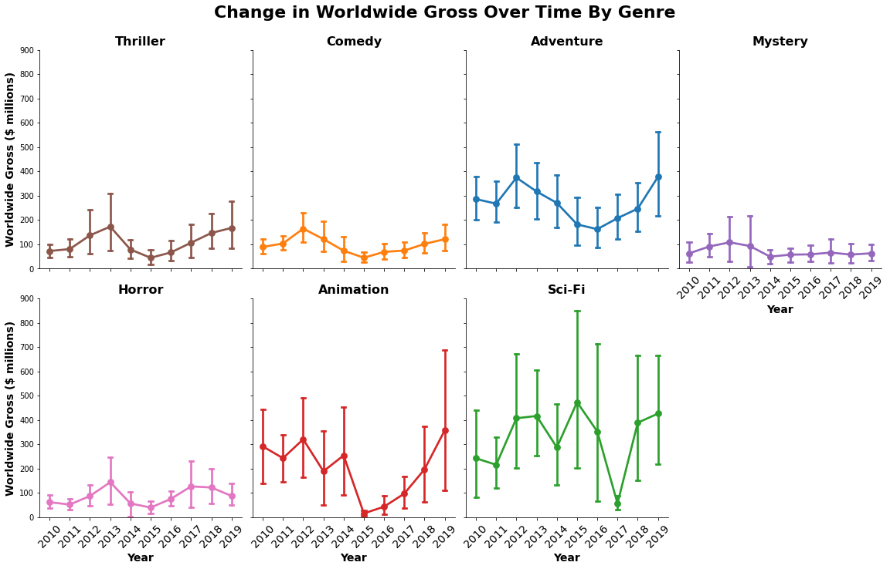

## Final Project Submission

Please fill out:
* Student name: Max Steele
* Student pace: full time
* Scheduled project review date/time: 
* Instructor name: James Irving
* Blog post URL:


# Introduction

Through this analysis, I will seek to answer the following questions:
1. Which genres are top grossing worldwide and have the highest return on investment?
* Of the top genres, how does movie budget affect return on investment?
* Of the top genres, how does genre influence movie rating?

# Data Preparation

The data used to answer the above questions, explore recent trends in the movie industry, and provide recommendations for Microsoft's new movie studio were obtained from IMDb. Two files were downloaded directly from files provided by IMDb (source: https://datasets.imdbws.com/; files: title.basics.tsv.gz and title.ratings.tsv.gz; documentation: https://www.imdb.com/interfaces/). The remainder of the data not directly provided in the files on the website was scraped as part of a collaborative effort. The code used for scraping was written by Sam Stoltenberg - github.com/skelouse, and can be found in the secondary imdb_webscrape notebook.


```python
import pandas as pd
import numpy as np
import seaborn as sns
import matplotlib.pyplot as plt
%matplotlib inline
```

    /Users/maxsteele/opt/anaconda3/envs/learn-env/lib/python3.6/site-packages/statsmodels/tools/_testing.py:19: FutureWarning: pandas.util.testing is deprecated. Use the functions in the public API at pandas.testing instead.
      import pandas.util.testing as tm


```python
## find the files in directory
import os
os.listdir('data_files/')
```


    ['budget_ratings.csv',
     'title.basics.tsv.gz',
     'title.ratings.tsv.gz',
     '.ipynb_checkpoints']


```python
## import files as a list
import glob
file_list = glob.glob('data_files/*sv*')
file_list
```


    ['data_files/budget_ratings.csv',
     'data_files/title.basics.tsv.gz',
     'data_files/title.ratings.tsv.gz']


```python
## test how to adjust file name to serve as an informative key name
file_list[0].split('/')[-1].replace('.csv', '')
```


    'budget_ratings'


```python
## create an empty dictionary data tables from files
TABLES = {}

## loop through my list of files
for file in file_list:
    
    ## if file name ends with .tsv.gz, read and separate by tabs
    try:
        if file.endswith('tsv.gz'):
            df = pd.read_csv(file, sep='\t', encoding = "latin-1", low_memory=False)
            key = file.split('/')[-1].replace('.tsv.gz', '').replace('.',"_")
     
    ## otherwise read the file as comma separated with defaults   
        else:
            df = pd.read_csv(file, low_memory=False, index_col=0)
            key = file.split('/')[-1].replace('.csv', '')
        
    ## if the above raises an error (due to issue with UTF-8 encoding), change from default encoding to latin-1
    ## and read by separating by tabs and set key name based on file name
    except UnicodeDecodeError:
        df = pd.read_csv(file, sep='\t', encoding = "latin-1", low_memory=False)
        key = file.split('/')[-1].replace('.tsv.gz', '').replace('.',"_")
    
    ## add each DataFrame that was read in to the TABLES dict with key based on file name
    TABLES[key] = df
```


```python
TABLES.keys()
```


    dict_keys(['budget_ratings', 'title_basics', 'title_ratings'])


```python
## assign each DataFrame from TABLES dict to its own variable
budget_ratings = TABLES['budget_ratings']
title_basics = TABLES['title_basics']
title_ratings = TABLES['title_ratings']
```

## Query IMDb Data Files


```python
## functions for checking out df's
import df_investigators as di
```


```python
di.check_ends(title_basics)
```


    (7023997, 9)


<div>
<style scoped>
    .dataframe tbody tr th:only-of-type {
        vertical-align: middle;
    }

    .dataframe tbody tr th {
        vertical-align: top;
    }

    .dataframe thead th {
        text-align: right;
    }
</style>
<table border="1" class="dataframe">
  <thead>
    <tr style="text-align: right;">
      <th></th>
      <th>tconst</th>
      <th>titleType</th>
      <th>primaryTitle</th>
      <th>originalTitle</th>
      <th>isAdult</th>
      <th>startYear</th>
      <th>endYear</th>
      <th>runtimeMinutes</th>
      <th>genres</th>
    </tr>
  </thead>
  <tbody>
    <tr>
      <th>0</th>
      <td>tt0000001</td>
      <td>short</td>
      <td>Carmencita</td>
      <td>Carmencita</td>
      <td>0</td>
      <td>1894</td>
      <td>\N</td>
      <td>1</td>
      <td>Documentary,Short</td>
    </tr>
    <tr>
      <th>1</th>
      <td>tt0000002</td>
      <td>short</td>
      <td>Le clown et ses chiens</td>
      <td>Le clown et ses chiens</td>
      <td>0</td>
      <td>1892</td>
      <td>\N</td>
      <td>5</td>
      <td>Animation,Short</td>
    </tr>
    <tr>
      <th>2</th>
      <td>tt0000003</td>
      <td>short</td>
      <td>Pauvre Pierrot</td>
      <td>Pauvre Pierrot</td>
      <td>0</td>
      <td>1892</td>
      <td>\N</td>
      <td>4</td>
      <td>Animation,Comedy,Romance</td>
    </tr>
    <tr>
      <th>3</th>
      <td>tt0000004</td>
      <td>short</td>
      <td>Un bon bock</td>
      <td>Un bon bock</td>
      <td>0</td>
      <td>1892</td>
      <td>\N</td>
      <td>12</td>
      <td>Animation,Short</td>
    </tr>
    <tr>
      <th>4</th>
      <td>tt0000005</td>
      <td>short</td>
      <td>Blacksmith Scene</td>
      <td>Blacksmith Scene</td>
      <td>0</td>
      <td>1893</td>
      <td>\N</td>
      <td>1</td>
      <td>Comedy,Short</td>
    </tr>
  </tbody>
</table>
</div>


<div>
<style scoped>
    .dataframe tbody tr th:only-of-type {
        vertical-align: middle;
    }

    .dataframe tbody tr th {
        vertical-align: top;
    }

    .dataframe thead th {
        text-align: right;
    }
</style>
<table border="1" class="dataframe">
  <thead>
    <tr style="text-align: right;">
      <th></th>
      <th>tconst</th>
      <th>titleType</th>
      <th>primaryTitle</th>
      <th>originalTitle</th>
      <th>isAdult</th>
      <th>startYear</th>
      <th>endYear</th>
      <th>runtimeMinutes</th>
      <th>genres</th>
    </tr>
  </thead>
  <tbody>
    <tr>
      <th>7023992</th>
      <td>tt9916848</td>
      <td>tvEpisode</td>
      <td>Episode #3.17</td>
      <td>Episode #3.17</td>
      <td>0</td>
      <td>2010</td>
      <td>\N</td>
      <td>\N</td>
      <td>Action,Drama,Family</td>
    </tr>
    <tr>
      <th>7023993</th>
      <td>tt9916850</td>
      <td>tvEpisode</td>
      <td>Episode #3.19</td>
      <td>Episode #3.19</td>
      <td>0</td>
      <td>2010</td>
      <td>\N</td>
      <td>\N</td>
      <td>Action,Drama,Family</td>
    </tr>
    <tr>
      <th>7023994</th>
      <td>tt9916852</td>
      <td>tvEpisode</td>
      <td>Episode #3.20</td>
      <td>Episode #3.20</td>
      <td>0</td>
      <td>2010</td>
      <td>\N</td>
      <td>\N</td>
      <td>Action,Drama,Family</td>
    </tr>
    <tr>
      <th>7023995</th>
      <td>tt9916856</td>
      <td>short</td>
      <td>The Wind</td>
      <td>The Wind</td>
      <td>0</td>
      <td>2015</td>
      <td>\N</td>
      <td>27</td>
      <td>Short</td>
    </tr>
    <tr>
      <th>7023996</th>
      <td>tt9916880</td>
      <td>tvEpisode</td>
      <td>Horrid Henry Knows It All</td>
      <td>Horrid Henry Knows It All</td>
      <td>0</td>
      <td>2014</td>
      <td>\N</td>
      <td>10</td>
      <td>Animation,Comedy,Family</td>
    </tr>
  </tbody>
</table>
</div>


```python
## only interested in movies, not tv shows, so need to be able to filter out non-movie categories
title_basics['titleType'].value_counts()
```


    tvEpisode       5028746
    short            752362
    movie            556830
    video            273501
    tvSeries         189009
    tvMovie          122764
    tvMiniSeries      32547
    tvSpecial         29144
    videoGame         26038
    tvShort           13056
    Name: titleType, dtype: int64


```python
from pandasql import sqldf

## define function to query DataFrames
pysqldf = lambda q: sqldf(q, globals())
```


```python
## select movie title IDs (tconst) from title_ratings df so that we only get movies that have ratings
## join on title_basics df to also filter movies by startYear and titleType

## only want movies made 2010 to 2019

q1 = """
SELECT tconst, titleType, primaryTitle, startYear, genres, averageRating 
FROM title_ratings
JOIN title_basics
USING(tconst)
WHERE startYear > 2009 
AND startYear < 2020
AND (titleType = 'movie')
"""
imdb_df = pysqldf(q1)
```


```python
def check_df(df):
    """
    returns a df reporting the dtype, num of null values, 
    % of null values, and num of unique values found in each column
    Source for code: written by James Irving - github.com/jirvingphd
    """
    info = {'dtypes':df.dtypes,
           'null values':df.isna().sum(),
            '% null': np.round((df.isna().sum()/len(df))*100,2),
           'nunique':df.nunique(),}
    return pd.DataFrame(info).head(len(df.columns))


def check_ends(df):
    """ returns dimensions, head, and tail of given df
    """
    return (display(df.shape, df.head(), df.tail()))
```


```python
check_ends(imdb_df)
```


    (83669, 6)


<div>
<style scoped>
    .dataframe tbody tr th:only-of-type {
        vertical-align: middle;
    }

    .dataframe tbody tr th {
        vertical-align: top;
    }

    .dataframe thead th {
        text-align: right;
    }
</style>
<table border="1" class="dataframe">
  <thead>
    <tr style="text-align: right;">
      <th></th>
      <th>tconst</th>
      <th>titleType</th>
      <th>primaryTitle</th>
      <th>startYear</th>
      <th>genres</th>
      <th>averageRating</th>
    </tr>
  </thead>
  <tbody>
    <tr>
      <th>0</th>
      <td>tt0016906</td>
      <td>movie</td>
      <td>Frivolinas</td>
      <td>2014</td>
      <td>Comedy,Musical</td>
      <td>5.6</td>
    </tr>
    <tr>
      <th>1</th>
      <td>tt0064322</td>
      <td>movie</td>
      <td>The Woman with the Knife</td>
      <td>2010</td>
      <td>Drama,Thriller</td>
      <td>6.7</td>
    </tr>
    <tr>
      <th>2</th>
      <td>tt0069049</td>
      <td>movie</td>
      <td>The Other Side of the Wind</td>
      <td>2018</td>
      <td>Drama</td>
      <td>6.8</td>
    </tr>
    <tr>
      <th>3</th>
      <td>tt0100275</td>
      <td>movie</td>
      <td>The Wandering Soap Opera</td>
      <td>2017</td>
      <td>Comedy,Drama,Fantasy</td>
      <td>6.6</td>
    </tr>
    <tr>
      <th>4</th>
      <td>tt0112502</td>
      <td>movie</td>
      <td>Bigfoot</td>
      <td>2017</td>
      <td>Horror,Thriller</td>
      <td>4.5</td>
    </tr>
  </tbody>
</table>
</div>


<div>
<style scoped>
    .dataframe tbody tr th:only-of-type {
        vertical-align: middle;
    }

    .dataframe tbody tr th {
        vertical-align: top;
    }

    .dataframe thead th {
        text-align: right;
    }
</style>
<table border="1" class="dataframe">
  <thead>
    <tr style="text-align: right;">
      <th></th>
      <th>tconst</th>
      <th>titleType</th>
      <th>primaryTitle</th>
      <th>startYear</th>
      <th>genres</th>
      <th>averageRating</th>
    </tr>
  </thead>
  <tbody>
    <tr>
      <th>83664</th>
      <td>tt9915790</td>
      <td>movie</td>
      <td>Bobbyr Bondhura</td>
      <td>2019</td>
      <td>Family</td>
      <td>7.3</td>
    </tr>
    <tr>
      <th>83665</th>
      <td>tt9916132</td>
      <td>movie</td>
      <td>The Mystery of a Buryat Lama</td>
      <td>2018</td>
      <td>Biography,Documentary,History</td>
      <td>3.6</td>
    </tr>
    <tr>
      <th>83666</th>
      <td>tt9916160</td>
      <td>movie</td>
      <td>Drømmeland</td>
      <td>2019</td>
      <td>Documentary</td>
      <td>6.6</td>
    </tr>
    <tr>
      <th>83667</th>
      <td>tt9916428</td>
      <td>movie</td>
      <td>The Secret of China</td>
      <td>2019</td>
      <td>Adventure,History,War</td>
      <td>3.5</td>
    </tr>
    <tr>
      <th>83668</th>
      <td>tt9916538</td>
      <td>movie</td>
      <td>Kuambil Lagi Hatiku</td>
      <td>2019</td>
      <td>Drama</td>
      <td>8.4</td>
    </tr>
  </tbody>
</table>
</div>


```python
check_ends(budget_ratings)
```


    (52943, 5)


<div>
<style scoped>
    .dataframe tbody tr th:only-of-type {
        vertical-align: middle;
    }

    .dataframe tbody tr th {
        vertical-align: top;
    }

    .dataframe thead th {
        text-align: right;
    }
</style>
<table border="1" class="dataframe">
  <thead>
    <tr style="text-align: right;">
      <th></th>
      <th>tconst</th>
      <th>budget</th>
      <th>gross</th>
      <th>ww_gross</th>
      <th>rating</th>
    </tr>
  </thead>
  <tbody>
    <tr>
      <th>0</th>
      <td>tt2200832</td>
      <td>NaN</td>
      <td>NaN</td>
      <td>NaN</td>
      <td>NotRated</td>
    </tr>
    <tr>
      <th>1</th>
      <td>tt2200860</td>
      <td>NaN</td>
      <td>NaN</td>
      <td>1924766.0</td>
      <td>NaN</td>
    </tr>
    <tr>
      <th>2</th>
      <td>tt2200908</td>
      <td>NaN</td>
      <td>NaN</td>
      <td>105367.0</td>
      <td>NaN</td>
    </tr>
    <tr>
      <th>3</th>
      <td>tt2200926</td>
      <td>NaN</td>
      <td>NaN</td>
      <td>5784.0</td>
      <td>NaN</td>
    </tr>
    <tr>
      <th>4</th>
      <td>tt2200955</td>
      <td>NaN</td>
      <td>NaN</td>
      <td>NaN</td>
      <td>Comedy</td>
    </tr>
  </tbody>
</table>
</div>


<div>
<style scoped>
    .dataframe tbody tr th:only-of-type {
        vertical-align: middle;
    }

    .dataframe tbody tr th {
        vertical-align: top;
    }

    .dataframe thead th {
        text-align: right;
    }
</style>
<table border="1" class="dataframe">
  <thead>
    <tr style="text-align: right;">
      <th></th>
      <th>tconst</th>
      <th>budget</th>
      <th>gross</th>
      <th>ww_gross</th>
      <th>rating</th>
    </tr>
  </thead>
  <tbody>
    <tr>
      <th>52938</th>
      <td>tt7225386</td>
      <td>NaN</td>
      <td>NaN</td>
      <td>10323404.0</td>
      <td>NaN</td>
    </tr>
    <tr>
      <th>52939</th>
      <td>tt7225648</td>
      <td>NaN</td>
      <td>NaN</td>
      <td>168615.0</td>
      <td>NaN</td>
    </tr>
    <tr>
      <th>52940</th>
      <td>tt7225942</td>
      <td>NaN</td>
      <td>NaN</td>
      <td>NaN</td>
      <td>Unrated</td>
    </tr>
    <tr>
      <th>52941</th>
      <td>tt7227044</td>
      <td>75000.0</td>
      <td>NaN</td>
      <td>NaN</td>
      <td>NaN</td>
    </tr>
    <tr>
      <th>52942</th>
      <td>tt7227100</td>
      <td>976709.0</td>
      <td>NaN</td>
      <td>32352.0</td>
      <td>NaN</td>
    </tr>
  </tbody>
</table>
</div>


```python
## join imdb_df with budget_ratings df on title id (tconst)

## only want movies made 2010 to 2019

q2 = """
SELECT tconst, primaryTitle, startYear, genres, averageRating, budget, ww_gross
FROM imdb_df
JOIN budget_ratings
USING(tconst)
"""
financial_df = pysqldf(q2)
```


```python
check_df(financial_df)
```


<div>
<style scoped>
    .dataframe tbody tr th:only-of-type {
        vertical-align: middle;
    }

    .dataframe tbody tr th {
        vertical-align: top;
    }

    .dataframe thead th {
        text-align: right;
    }
</style>
<table border="1" class="dataframe">
  <thead>
    <tr style="text-align: right;">
      <th></th>
      <th>dtypes</th>
      <th>null values</th>
      <th>% null</th>
      <th>nunique</th>
    </tr>
  </thead>
  <tbody>
    <tr>
      <th>tconst</th>
      <td>object</td>
      <td>0</td>
      <td>0.00</td>
      <td>46514</td>
    </tr>
    <tr>
      <th>primaryTitle</th>
      <td>object</td>
      <td>0</td>
      <td>0.00</td>
      <td>44582</td>
    </tr>
    <tr>
      <th>startYear</th>
      <td>object</td>
      <td>0</td>
      <td>0.00</td>
      <td>10</td>
    </tr>
    <tr>
      <th>genres</th>
      <td>object</td>
      <td>0</td>
      <td>0.00</td>
      <td>826</td>
    </tr>
    <tr>
      <th>averageRating</th>
      <td>float64</td>
      <td>0</td>
      <td>0.00</td>
      <td>91</td>
    </tr>
    <tr>
      <th>budget</th>
      <td>float64</td>
      <td>28457</td>
      <td>61.18</td>
      <td>1241</td>
    </tr>
    <tr>
      <th>ww_gross</th>
      <td>float64</td>
      <td>25960</td>
      <td>55.81</td>
      <td>19972</td>
    </tr>
  </tbody>
</table>
</div>


```python
check_ends(financial_df)
```


    (46514, 7)


<div>
<style scoped>
    .dataframe tbody tr th:only-of-type {
        vertical-align: middle;
    }

    .dataframe tbody tr th {
        vertical-align: top;
    }

    .dataframe thead th {
        text-align: right;
    }
</style>
<table border="1" class="dataframe">
  <thead>
    <tr style="text-align: right;">
      <th></th>
      <th>tconst</th>
      <th>primaryTitle</th>
      <th>startYear</th>
      <th>genres</th>
      <th>averageRating</th>
      <th>budget</th>
      <th>ww_gross</th>
    </tr>
  </thead>
  <tbody>
    <tr>
      <th>0</th>
      <td>tt0069049</td>
      <td>The Other Side of the Wind</td>
      <td>2018</td>
      <td>Drama</td>
      <td>6.8</td>
      <td>NaN</td>
      <td>NaN</td>
    </tr>
    <tr>
      <th>1</th>
      <td>tt0100275</td>
      <td>The Wandering Soap Opera</td>
      <td>2017</td>
      <td>Comedy,Drama,Fantasy</td>
      <td>6.6</td>
      <td>NaN</td>
      <td>3624.0</td>
    </tr>
    <tr>
      <th>2</th>
      <td>tt0112502</td>
      <td>Bigfoot</td>
      <td>2017</td>
      <td>Horror,Thriller</td>
      <td>4.5</td>
      <td>1300000.0</td>
      <td>NaN</td>
    </tr>
    <tr>
      <th>3</th>
      <td>tt0116991</td>
      <td>Mariette in Ecstasy</td>
      <td>2019</td>
      <td>Drama</td>
      <td>7.5</td>
      <td>NaN</td>
      <td>NaN</td>
    </tr>
    <tr>
      <th>4</th>
      <td>tt0159369</td>
      <td>Cooper and Hemingway: The True Gen</td>
      <td>2013</td>
      <td>Documentary</td>
      <td>7.6</td>
      <td>NaN</td>
      <td>NaN</td>
    </tr>
  </tbody>
</table>
</div>


<div>
<style scoped>
    .dataframe tbody tr th:only-of-type {
        vertical-align: middle;
    }

    .dataframe tbody tr th {
        vertical-align: top;
    }

    .dataframe thead th {
        text-align: right;
    }
</style>
<table border="1" class="dataframe">
  <thead>
    <tr style="text-align: right;">
      <th></th>
      <th>tconst</th>
      <th>primaryTitle</th>
      <th>startYear</th>
      <th>genres</th>
      <th>averageRating</th>
      <th>budget</th>
      <th>ww_gross</th>
    </tr>
  </thead>
  <tbody>
    <tr>
      <th>46509</th>
      <td>tt8688048</td>
      <td>Cinderella: The Enchanted Beginning</td>
      <td>2018</td>
      <td>Family</td>
      <td>3.2</td>
      <td>NaN</td>
      <td>NaN</td>
    </tr>
    <tr>
      <th>46510</th>
      <td>tt8688634</td>
      <td>21 Bridges</td>
      <td>2019</td>
      <td>Action,Crime,Drama</td>
      <td>6.6</td>
      <td>33000000.0</td>
      <td>49939757.0</td>
    </tr>
    <tr>
      <th>46511</th>
      <td>tt8688912</td>
      <td>Chi La Sow?</td>
      <td>2018</td>
      <td>Comedy,Romance</td>
      <td>7.8</td>
      <td>NaN</td>
      <td>4551.0</td>
    </tr>
    <tr>
      <th>46512</th>
      <td>tt8689644</td>
      <td>Hearts and Bones</td>
      <td>2019</td>
      <td>Drama</td>
      <td>6.6</td>
      <td>NaN</td>
      <td>87522.0</td>
    </tr>
    <tr>
      <th>46513</th>
      <td>tt8689858</td>
      <td>Alienated</td>
      <td>2019</td>
      <td>Drama</td>
      <td>4.0</td>
      <td>40000.0</td>
      <td>NaN</td>
    </tr>
  </tbody>
</table>
</div>


### Missing Values in IMDb DataFrame without Financial Information


```python
## no values are showing up as null values, should check for placeholder values
display(imdb_df.info())
check_df(imdb_df)
```

    <class 'pandas.core.frame.DataFrame'>
    RangeIndex: 83669 entries, 0 to 83668
    Data columns (total 6 columns):
     #   Column         Non-Null Count  Dtype  
    ---  ------         --------------  -----  
     0   tconst         83669 non-null  object 
     1   titleType      83669 non-null  object 
     2   primaryTitle   83669 non-null  object 
     3   startYear      83669 non-null  object 
     4   genres         83669 non-null  object 
     5   averageRating  83669 non-null  float64
    dtypes: float64(1), object(5)
    memory usage: 3.8+ MB


    None


<div>
<style scoped>
    .dataframe tbody tr th:only-of-type {
        vertical-align: middle;
    }

    .dataframe tbody tr th {
        vertical-align: top;
    }

    .dataframe thead th {
        text-align: right;
    }
</style>
<table border="1" class="dataframe">
  <thead>
    <tr style="text-align: right;">
      <th></th>
      <th>dtypes</th>
      <th>null values</th>
      <th>% null</th>
      <th>nunique</th>
    </tr>
  </thead>
  <tbody>
    <tr>
      <th>tconst</th>
      <td>object</td>
      <td>0</td>
      <td>0.0</td>
      <td>83669</td>
    </tr>
    <tr>
      <th>titleType</th>
      <td>object</td>
      <td>0</td>
      <td>0.0</td>
      <td>1</td>
    </tr>
    <tr>
      <th>primaryTitle</th>
      <td>object</td>
      <td>0</td>
      <td>0.0</td>
      <td>78929</td>
    </tr>
    <tr>
      <th>startYear</th>
      <td>object</td>
      <td>0</td>
      <td>0.0</td>
      <td>10</td>
    </tr>
    <tr>
      <th>genres</th>
      <td>object</td>
      <td>0</td>
      <td>0.0</td>
      <td>960</td>
    </tr>
    <tr>
      <th>averageRating</th>
      <td>float64</td>
      <td>0</td>
      <td>0.0</td>
      <td>91</td>
    </tr>
  </tbody>
</table>
</div>


The only column with missing values is 'genres'. Since the questions I want to answer focus quite a lot on genre, dropping the 863 records missing genre information out of the total 83,669 is acceptable given that it represents such a small portion of the entire dataset.


```python
# check how many missing values (placeholder '\N's) there are and where they are
for col in imdb_df.columns:
    
    ## show the head of sliced DataFrames where value in each column is '\\N'
    display(imdb_df.loc[imdb_df[col]=='\\N'].head())
    
    ## print the name of the column and the length of the dataframe created for each column
    ## (corresponds to total number of missing values for that variable)
    print('{}: {}'.format(col, len(imdb_df.loc[imdb_df[col]=='\\N'])))
```


<div>
<style scoped>
    .dataframe tbody tr th:only-of-type {
        vertical-align: middle;
    }

    .dataframe tbody tr th {
        vertical-align: top;
    }

    .dataframe thead th {
        text-align: right;
    }
</style>
<table border="1" class="dataframe">
  <thead>
    <tr style="text-align: right;">
      <th></th>
      <th>tconst</th>
      <th>titleType</th>
      <th>primaryTitle</th>
      <th>startYear</th>
      <th>genres</th>
      <th>averageRating</th>
    </tr>
  </thead>
  <tbody>
  </tbody>
</table>
</div>


    tconst: 0


<div>
<style scoped>
    .dataframe tbody tr th:only-of-type {
        vertical-align: middle;
    }

    .dataframe tbody tr th {
        vertical-align: top;
    }

    .dataframe thead th {
        text-align: right;
    }
</style>
<table border="1" class="dataframe">
  <thead>
    <tr style="text-align: right;">
      <th></th>
      <th>tconst</th>
      <th>titleType</th>
      <th>primaryTitle</th>
      <th>startYear</th>
      <th>genres</th>
      <th>averageRating</th>
    </tr>
  </thead>
  <tbody>
  </tbody>
</table>
</div>


    titleType: 0


<div>
<style scoped>
    .dataframe tbody tr th:only-of-type {
        vertical-align: middle;
    }

    .dataframe tbody tr th {
        vertical-align: top;
    }

    .dataframe thead th {
        text-align: right;
    }
</style>
<table border="1" class="dataframe">
  <thead>
    <tr style="text-align: right;">
      <th></th>
      <th>tconst</th>
      <th>titleType</th>
      <th>primaryTitle</th>
      <th>startYear</th>
      <th>genres</th>
      <th>averageRating</th>
    </tr>
  </thead>
  <tbody>
  </tbody>
</table>
</div>


    primaryTitle: 0


<div>
<style scoped>
    .dataframe tbody tr th:only-of-type {
        vertical-align: middle;
    }

    .dataframe tbody tr th {
        vertical-align: top;
    }

    .dataframe thead th {
        text-align: right;
    }
</style>
<table border="1" class="dataframe">
  <thead>
    <tr style="text-align: right;">
      <th></th>
      <th>tconst</th>
      <th>titleType</th>
      <th>primaryTitle</th>
      <th>startYear</th>
      <th>genres</th>
      <th>averageRating</th>
    </tr>
  </thead>
  <tbody>
  </tbody>
</table>
</div>


    startYear: 0


<div>
<style scoped>
    .dataframe tbody tr th:only-of-type {
        vertical-align: middle;
    }

    .dataframe tbody tr th {
        vertical-align: top;
    }

    .dataframe thead th {
        text-align: right;
    }
</style>
<table border="1" class="dataframe">
  <thead>
    <tr style="text-align: right;">
      <th></th>
      <th>tconst</th>
      <th>titleType</th>
      <th>primaryTitle</th>
      <th>startYear</th>
      <th>genres</th>
      <th>averageRating</th>
    </tr>
  </thead>
  <tbody>
    <tr>
      <th>24</th>
      <td>tt0306058</td>
      <td>movie</td>
      <td>Second Coming</td>
      <td>2012</td>
      <td>\N</td>
      <td>5.5</td>
    </tr>
    <tr>
      <th>28</th>
      <td>tt0326592</td>
      <td>movie</td>
      <td>The Overnight</td>
      <td>2010</td>
      <td>\N</td>
      <td>7.5</td>
    </tr>
    <tr>
      <th>33</th>
      <td>tt0330811</td>
      <td>movie</td>
      <td>Regret Not Speaking</td>
      <td>2011</td>
      <td>\N</td>
      <td>6.2</td>
    </tr>
    <tr>
      <th>778</th>
      <td>tt10087946</td>
      <td>movie</td>
      <td>Six Characters in Search of a Play</td>
      <td>2019</td>
      <td>\N</td>
      <td>4.7</td>
    </tr>
    <tr>
      <th>786</th>
      <td>tt10091972</td>
      <td>movie</td>
      <td>Demashq Halab</td>
      <td>2019</td>
      <td>\N</td>
      <td>5.8</td>
    </tr>
  </tbody>
</table>
</div>


    genres: 863


    /Users/maxsteele/opt/anaconda3/envs/learn-env/lib/python3.6/site-packages/pandas/core/ops/array_ops.py:253: FutureWarning: elementwise comparison failed; returning scalar instead, but in the future will perform elementwise comparison
      res_values = method(rvalues)


<div>
<style scoped>
    .dataframe tbody tr th:only-of-type {
        vertical-align: middle;
    }

    .dataframe tbody tr th {
        vertical-align: top;
    }

    .dataframe thead th {
        text-align: right;
    }
</style>
<table border="1" class="dataframe">
  <thead>
    <tr style="text-align: right;">
      <th></th>
      <th>tconst</th>
      <th>titleType</th>
      <th>primaryTitle</th>
      <th>startYear</th>
      <th>genres</th>
      <th>averageRating</th>
    </tr>
  </thead>
  <tbody>
  </tbody>
</table>
</div>


    averageRating: 0


    /Users/maxsteele/opt/anaconda3/envs/learn-env/lib/python3.6/site-packages/pandas/core/ops/array_ops.py:253: FutureWarning: elementwise comparison failed; returning scalar instead, but in the future will perform elementwise comparison
      res_values = method(rvalues)


```python
## drop records that contain those missing values
imdb_df.drop(imdb_df.loc[imdb_df['genres']=='\\N'].index, inplace=True)

## reset index now that rows have been dropped
imdb_df = imdb_df.reset_index(drop=True)
```


```python
## check to make sure those placeholders are gone
for col in imdb_df.columns:
    
    ## show the head of sliced DataFrames where value in each column is '\\N'
    display(imdb_df.loc[imdb_df[col]=='\\N'].head())
    
    ## print the name of the column and the length of the dataframe created for each column
    ## (corresponds to total number of missing values for that variable)
    print('{}: {}'.format(col, len(imdb_df.loc[imdb_df[col]=='\\N'])))
```


<div>
<style scoped>
    .dataframe tbody tr th:only-of-type {
        vertical-align: middle;
    }

    .dataframe tbody tr th {
        vertical-align: top;
    }

    .dataframe thead th {
        text-align: right;
    }
</style>
<table border="1" class="dataframe">
  <thead>
    <tr style="text-align: right;">
      <th></th>
      <th>tconst</th>
      <th>titleType</th>
      <th>primaryTitle</th>
      <th>startYear</th>
      <th>genres</th>
      <th>averageRating</th>
    </tr>
  </thead>
  <tbody>
  </tbody>
</table>
</div>


    tconst: 0


<div>
<style scoped>
    .dataframe tbody tr th:only-of-type {
        vertical-align: middle;
    }

    .dataframe tbody tr th {
        vertical-align: top;
    }

    .dataframe thead th {
        text-align: right;
    }
</style>
<table border="1" class="dataframe">
  <thead>
    <tr style="text-align: right;">
      <th></th>
      <th>tconst</th>
      <th>titleType</th>
      <th>primaryTitle</th>
      <th>startYear</th>
      <th>genres</th>
      <th>averageRating</th>
    </tr>
  </thead>
  <tbody>
  </tbody>
</table>
</div>


    titleType: 0


<div>
<style scoped>
    .dataframe tbody tr th:only-of-type {
        vertical-align: middle;
    }

    .dataframe tbody tr th {
        vertical-align: top;
    }

    .dataframe thead th {
        text-align: right;
    }
</style>
<table border="1" class="dataframe">
  <thead>
    <tr style="text-align: right;">
      <th></th>
      <th>tconst</th>
      <th>titleType</th>
      <th>primaryTitle</th>
      <th>startYear</th>
      <th>genres</th>
      <th>averageRating</th>
    </tr>
  </thead>
  <tbody>
  </tbody>
</table>
</div>


    primaryTitle: 0


<div>
<style scoped>
    .dataframe tbody tr th:only-of-type {
        vertical-align: middle;
    }

    .dataframe tbody tr th {
        vertical-align: top;
    }

    .dataframe thead th {
        text-align: right;
    }
</style>
<table border="1" class="dataframe">
  <thead>
    <tr style="text-align: right;">
      <th></th>
      <th>tconst</th>
      <th>titleType</th>
      <th>primaryTitle</th>
      <th>startYear</th>
      <th>genres</th>
      <th>averageRating</th>
    </tr>
  </thead>
  <tbody>
  </tbody>
</table>
</div>


    startYear: 0


<div>
<style scoped>
    .dataframe tbody tr th:only-of-type {
        vertical-align: middle;
    }

    .dataframe tbody tr th {
        vertical-align: top;
    }

    .dataframe thead th {
        text-align: right;
    }
</style>
<table border="1" class="dataframe">
  <thead>
    <tr style="text-align: right;">
      <th></th>
      <th>tconst</th>
      <th>titleType</th>
      <th>primaryTitle</th>
      <th>startYear</th>
      <th>genres</th>
      <th>averageRating</th>
    </tr>
  </thead>
  <tbody>
  </tbody>
</table>
</div>


    genres: 0


    /Users/maxsteele/opt/anaconda3/envs/learn-env/lib/python3.6/site-packages/pandas/core/ops/array_ops.py:253: FutureWarning: elementwise comparison failed; returning scalar instead, but in the future will perform elementwise comparison
      res_values = method(rvalues)


<div>
<style scoped>
    .dataframe tbody tr th:only-of-type {
        vertical-align: middle;
    }

    .dataframe tbody tr th {
        vertical-align: top;
    }

    .dataframe thead th {
        text-align: right;
    }
</style>
<table border="1" class="dataframe">
  <thead>
    <tr style="text-align: right;">
      <th></th>
      <th>tconst</th>
      <th>titleType</th>
      <th>primaryTitle</th>
      <th>startYear</th>
      <th>genres</th>
      <th>averageRating</th>
    </tr>
  </thead>
  <tbody>
  </tbody>
</table>
</div>


    averageRating: 0


    /Users/maxsteele/opt/anaconda3/envs/learn-env/lib/python3.6/site-packages/pandas/core/ops/array_ops.py:253: FutureWarning: elementwise comparison failed; returning scalar instead, but in the future will perform elementwise comparison
      res_values = method(rvalues)


```python
## still left with 82806 movies for full imdb_df without financial info
len(imdb_df)
```


    82806


```python
## convert startYear into integers
imdb_df['startYear'] = imdb_df['startYear'].astype(int)
imdb_df.info()
```

    <class 'pandas.core.frame.DataFrame'>
    RangeIndex: 82806 entries, 0 to 82805
    Data columns (total 6 columns):
     #   Column         Non-Null Count  Dtype  
    ---  ------         --------------  -----  
     0   tconst         82806 non-null  object 
     1   titleType      82806 non-null  object 
     2   primaryTitle   82806 non-null  object 
     3   startYear      82806 non-null  int64  
     4   genres         82806 non-null  object 
     5   averageRating  82806 non-null  float64
    dtypes: float64(1), int64(1), object(4)
    memory usage: 3.8+ MB


### Format Genre Information and Columns


```python
## create 'genre_list' col where the genres are contained in a list rather than one long string
imdb_df['genre_list'] = imdb_df['genres'].apply(lambda x: x.split(','))

print(type(imdb_df['genre_list'][0]))
imdb_df['genre_list'][0]
```

    <class 'list'>


    ['Comedy', 'Musical']


```python
## need to create a column for each genre to be filled w/ boolean values based on the genre(s) of ea movie

## join all genres in the 'genres' col into one long string
all_genres_string = ','.join(imdb_df['genres'])

## split that string by commas, use set() to return only unique values, make those values into a list
all_genres_list = list(set(all_genres_string.split(',')))
all_genres_list = all_genres_list[1:] # first category was empty string, take it out

## use ea item in the list to make cols in df and fill that column with boolean if is/is not that genre
for genre in all_genres_list:
    imdb_df[genre] = imdb_df['genres'].str.contains(genre)

imdb_df.head()
```


<div>
<style scoped>
    .dataframe tbody tr th:only-of-type {
        vertical-align: middle;
    }

    .dataframe tbody tr th {
        vertical-align: top;
    }

    .dataframe thead th {
        text-align: right;
    }
</style>
<table border="1" class="dataframe">
  <thead>
    <tr style="text-align: right;">
      <th></th>
      <th>tconst</th>
      <th>titleType</th>
      <th>primaryTitle</th>
      <th>startYear</th>
      <th>genres</th>
      <th>averageRating</th>
      <th>genre_list</th>
      <th>Biography</th>
      <th>Thriller</th>
      <th>Fantasy</th>
      <th>...</th>
      <th>Horror</th>
      <th>Talk-Show</th>
      <th>Adult</th>
      <th>Family</th>
      <th>Game-Show</th>
      <th>Romance</th>
      <th>History</th>
      <th>Musical</th>
      <th>Sci-Fi</th>
      <th>Adventure</th>
    </tr>
  </thead>
  <tbody>
    <tr>
      <th>0</th>
      <td>tt0016906</td>
      <td>movie</td>
      <td>Frivolinas</td>
      <td>2014</td>
      <td>Comedy,Musical</td>
      <td>5.6</td>
      <td>[Comedy, Musical]</td>
      <td>False</td>
      <td>False</td>
      <td>False</td>
      <td>...</td>
      <td>False</td>
      <td>False</td>
      <td>False</td>
      <td>False</td>
      <td>False</td>
      <td>False</td>
      <td>False</td>
      <td>True</td>
      <td>False</td>
      <td>False</td>
    </tr>
    <tr>
      <th>1</th>
      <td>tt0064322</td>
      <td>movie</td>
      <td>The Woman with the Knife</td>
      <td>2010</td>
      <td>Drama,Thriller</td>
      <td>6.7</td>
      <td>[Drama, Thriller]</td>
      <td>False</td>
      <td>True</td>
      <td>False</td>
      <td>...</td>
      <td>False</td>
      <td>False</td>
      <td>False</td>
      <td>False</td>
      <td>False</td>
      <td>False</td>
      <td>False</td>
      <td>False</td>
      <td>False</td>
      <td>False</td>
    </tr>
    <tr>
      <th>2</th>
      <td>tt0069049</td>
      <td>movie</td>
      <td>The Other Side of the Wind</td>
      <td>2018</td>
      <td>Drama</td>
      <td>6.8</td>
      <td>[Drama]</td>
      <td>False</td>
      <td>False</td>
      <td>False</td>
      <td>...</td>
      <td>False</td>
      <td>False</td>
      <td>False</td>
      <td>False</td>
      <td>False</td>
      <td>False</td>
      <td>False</td>
      <td>False</td>
      <td>False</td>
      <td>False</td>
    </tr>
    <tr>
      <th>3</th>
      <td>tt0100275</td>
      <td>movie</td>
      <td>The Wandering Soap Opera</td>
      <td>2017</td>
      <td>Comedy,Drama,Fantasy</td>
      <td>6.6</td>
      <td>[Comedy, Drama, Fantasy]</td>
      <td>False</td>
      <td>False</td>
      <td>True</td>
      <td>...</td>
      <td>False</td>
      <td>False</td>
      <td>False</td>
      <td>False</td>
      <td>False</td>
      <td>False</td>
      <td>False</td>
      <td>False</td>
      <td>False</td>
      <td>False</td>
    </tr>
    <tr>
      <th>4</th>
      <td>tt0112502</td>
      <td>movie</td>
      <td>Bigfoot</td>
      <td>2017</td>
      <td>Horror,Thriller</td>
      <td>4.5</td>
      <td>[Horror, Thriller]</td>
      <td>False</td>
      <td>True</td>
      <td>False</td>
      <td>...</td>
      <td>True</td>
      <td>False</td>
      <td>False</td>
      <td>False</td>
      <td>False</td>
      <td>False</td>
      <td>False</td>
      <td>False</td>
      <td>False</td>
      <td>False</td>
    </tr>
  </tbody>
</table>
<p>5 rows × 32 columns</p>
</div>


```python
## add a column for the number of genres a movie spans

## new 'genre_count' col is filled with the sum of all T/F values across all the genre cols for that row
## (axis=1 specifies to add across the row rather than down the col)
imdb_df['genre_count'] = imdb_df[all_genres_list].sum(axis=1)

imdb_df.head()
```


<div>
<style scoped>
    .dataframe tbody tr th:only-of-type {
        vertical-align: middle;
    }

    .dataframe tbody tr th {
        vertical-align: top;
    }

    .dataframe thead th {
        text-align: right;
    }
</style>
<table border="1" class="dataframe">
  <thead>
    <tr style="text-align: right;">
      <th></th>
      <th>tconst</th>
      <th>titleType</th>
      <th>primaryTitle</th>
      <th>startYear</th>
      <th>genres</th>
      <th>averageRating</th>
      <th>genre_list</th>
      <th>Biography</th>
      <th>Thriller</th>
      <th>Fantasy</th>
      <th>...</th>
      <th>Talk-Show</th>
      <th>Adult</th>
      <th>Family</th>
      <th>Game-Show</th>
      <th>Romance</th>
      <th>History</th>
      <th>Musical</th>
      <th>Sci-Fi</th>
      <th>Adventure</th>
      <th>genre_count</th>
    </tr>
  </thead>
  <tbody>
    <tr>
      <th>0</th>
      <td>tt0016906</td>
      <td>movie</td>
      <td>Frivolinas</td>
      <td>2014</td>
      <td>Comedy,Musical</td>
      <td>5.6</td>
      <td>[Comedy, Musical]</td>
      <td>False</td>
      <td>False</td>
      <td>False</td>
      <td>...</td>
      <td>False</td>
      <td>False</td>
      <td>False</td>
      <td>False</td>
      <td>False</td>
      <td>False</td>
      <td>True</td>
      <td>False</td>
      <td>False</td>
      <td>3</td>
    </tr>
    <tr>
      <th>1</th>
      <td>tt0064322</td>
      <td>movie</td>
      <td>The Woman with the Knife</td>
      <td>2010</td>
      <td>Drama,Thriller</td>
      <td>6.7</td>
      <td>[Drama, Thriller]</td>
      <td>False</td>
      <td>True</td>
      <td>False</td>
      <td>...</td>
      <td>False</td>
      <td>False</td>
      <td>False</td>
      <td>False</td>
      <td>False</td>
      <td>False</td>
      <td>False</td>
      <td>False</td>
      <td>False</td>
      <td>2</td>
    </tr>
    <tr>
      <th>2</th>
      <td>tt0069049</td>
      <td>movie</td>
      <td>The Other Side of the Wind</td>
      <td>2018</td>
      <td>Drama</td>
      <td>6.8</td>
      <td>[Drama]</td>
      <td>False</td>
      <td>False</td>
      <td>False</td>
      <td>...</td>
      <td>False</td>
      <td>False</td>
      <td>False</td>
      <td>False</td>
      <td>False</td>
      <td>False</td>
      <td>False</td>
      <td>False</td>
      <td>False</td>
      <td>1</td>
    </tr>
    <tr>
      <th>3</th>
      <td>tt0100275</td>
      <td>movie</td>
      <td>The Wandering Soap Opera</td>
      <td>2017</td>
      <td>Comedy,Drama,Fantasy</td>
      <td>6.6</td>
      <td>[Comedy, Drama, Fantasy]</td>
      <td>False</td>
      <td>False</td>
      <td>True</td>
      <td>...</td>
      <td>False</td>
      <td>False</td>
      <td>False</td>
      <td>False</td>
      <td>False</td>
      <td>False</td>
      <td>False</td>
      <td>False</td>
      <td>False</td>
      <td>3</td>
    </tr>
    <tr>
      <th>4</th>
      <td>tt0112502</td>
      <td>movie</td>
      <td>Bigfoot</td>
      <td>2017</td>
      <td>Horror,Thriller</td>
      <td>4.5</td>
      <td>[Horror, Thriller]</td>
      <td>False</td>
      <td>True</td>
      <td>False</td>
      <td>...</td>
      <td>False</td>
      <td>False</td>
      <td>False</td>
      <td>False</td>
      <td>False</td>
      <td>False</td>
      <td>False</td>
      <td>False</td>
      <td>False</td>
      <td>2</td>
    </tr>
  </tbody>
</table>
<p>5 rows × 33 columns</p>
</div>


```python
explode_genre = imdb_df.explode('genre_list') 
# could group by genre and get sum of revenue or similar aggr info
explode_genre.head()
```


<div>
<style scoped>
    .dataframe tbody tr th:only-of-type {
        vertical-align: middle;
    }

    .dataframe tbody tr th {
        vertical-align: top;
    }

    .dataframe thead th {
        text-align: right;
    }
</style>
<table border="1" class="dataframe">
  <thead>
    <tr style="text-align: right;">
      <th></th>
      <th>tconst</th>
      <th>titleType</th>
      <th>primaryTitle</th>
      <th>startYear</th>
      <th>genres</th>
      <th>averageRating</th>
      <th>genre_list</th>
      <th>Biography</th>
      <th>Thriller</th>
      <th>Fantasy</th>
      <th>...</th>
      <th>Talk-Show</th>
      <th>Adult</th>
      <th>Family</th>
      <th>Game-Show</th>
      <th>Romance</th>
      <th>History</th>
      <th>Musical</th>
      <th>Sci-Fi</th>
      <th>Adventure</th>
      <th>genre_count</th>
    </tr>
  </thead>
  <tbody>
    <tr>
      <th>0</th>
      <td>tt0016906</td>
      <td>movie</td>
      <td>Frivolinas</td>
      <td>2014</td>
      <td>Comedy,Musical</td>
      <td>5.6</td>
      <td>Comedy</td>
      <td>False</td>
      <td>False</td>
      <td>False</td>
      <td>...</td>
      <td>False</td>
      <td>False</td>
      <td>False</td>
      <td>False</td>
      <td>False</td>
      <td>False</td>
      <td>True</td>
      <td>False</td>
      <td>False</td>
      <td>3</td>
    </tr>
    <tr>
      <th>0</th>
      <td>tt0016906</td>
      <td>movie</td>
      <td>Frivolinas</td>
      <td>2014</td>
      <td>Comedy,Musical</td>
      <td>5.6</td>
      <td>Musical</td>
      <td>False</td>
      <td>False</td>
      <td>False</td>
      <td>...</td>
      <td>False</td>
      <td>False</td>
      <td>False</td>
      <td>False</td>
      <td>False</td>
      <td>False</td>
      <td>True</td>
      <td>False</td>
      <td>False</td>
      <td>3</td>
    </tr>
    <tr>
      <th>1</th>
      <td>tt0064322</td>
      <td>movie</td>
      <td>The Woman with the Knife</td>
      <td>2010</td>
      <td>Drama,Thriller</td>
      <td>6.7</td>
      <td>Drama</td>
      <td>False</td>
      <td>True</td>
      <td>False</td>
      <td>...</td>
      <td>False</td>
      <td>False</td>
      <td>False</td>
      <td>False</td>
      <td>False</td>
      <td>False</td>
      <td>False</td>
      <td>False</td>
      <td>False</td>
      <td>2</td>
    </tr>
    <tr>
      <th>1</th>
      <td>tt0064322</td>
      <td>movie</td>
      <td>The Woman with the Knife</td>
      <td>2010</td>
      <td>Drama,Thriller</td>
      <td>6.7</td>
      <td>Thriller</td>
      <td>False</td>
      <td>True</td>
      <td>False</td>
      <td>...</td>
      <td>False</td>
      <td>False</td>
      <td>False</td>
      <td>False</td>
      <td>False</td>
      <td>False</td>
      <td>False</td>
      <td>False</td>
      <td>False</td>
      <td>2</td>
    </tr>
    <tr>
      <th>2</th>
      <td>tt0069049</td>
      <td>movie</td>
      <td>The Other Side of the Wind</td>
      <td>2018</td>
      <td>Drama</td>
      <td>6.8</td>
      <td>Drama</td>
      <td>False</td>
      <td>False</td>
      <td>False</td>
      <td>...</td>
      <td>False</td>
      <td>False</td>
      <td>False</td>
      <td>False</td>
      <td>False</td>
      <td>False</td>
      <td>False</td>
      <td>False</td>
      <td>False</td>
      <td>1</td>
    </tr>
  </tbody>
</table>
<p>5 rows × 33 columns</p>
</div>


## Financial  DataFrame Missing Values and Data Cleaning


```python
display(financial_df.info())
financial_df.describe()
```

    <class 'pandas.core.frame.DataFrame'>
    RangeIndex: 46514 entries, 0 to 46513
    Data columns (total 7 columns):
     #   Column         Non-Null Count  Dtype  
    ---  ------         --------------  -----  
     0   tconst         46514 non-null  object 
     1   primaryTitle   46514 non-null  object 
     2   startYear      46514 non-null  object 
     3   genres         46514 non-null  object 
     4   averageRating  46514 non-null  float64
     5   budget         18057 non-null  float64
     6   ww_gross       20554 non-null  float64
    dtypes: float64(3), object(4)
    memory usage: 2.5+ MB


    None


<div>
<style scoped>
    .dataframe tbody tr th:only-of-type {
        vertical-align: middle;
    }

    .dataframe tbody tr th {
        vertical-align: top;
    }

    .dataframe thead th {
        text-align: right;
    }
</style>
<table border="1" class="dataframe">
  <thead>
    <tr style="text-align: right;">
      <th></th>
      <th>averageRating</th>
      <th>budget</th>
      <th>ww_gross</th>
    </tr>
  </thead>
  <tbody>
    <tr>
      <th>count</th>
      <td>46514.000000</td>
      <td>1.805700e+04</td>
      <td>2.055400e+04</td>
    </tr>
    <tr>
      <th>mean</th>
      <td>6.089777</td>
      <td>6.562330e+06</td>
      <td>1.649856e+07</td>
    </tr>
    <tr>
      <th>std</th>
      <td>1.434893</td>
      <td>3.156870e+07</td>
      <td>8.626953e+07</td>
    </tr>
    <tr>
      <th>min</th>
      <td>1.000000</td>
      <td>0.000000e+00</td>
      <td>0.000000e+00</td>
    </tr>
    <tr>
      <th>25%</th>
      <td>5.200000</td>
      <td>5.000000e+03</td>
      <td>3.482925e+04</td>
    </tr>
    <tr>
      <th>50%</th>
      <td>6.200000</td>
      <td>1.850000e+05</td>
      <td>3.298395e+05</td>
    </tr>
    <tr>
      <th>75%</th>
      <td>7.100000</td>
      <td>1.000000e+06</td>
      <td>2.966457e+06</td>
    </tr>
    <tr>
      <th>max</th>
      <td>10.000000</td>
      <td>9.000000e+08</td>
      <td>2.797801e+09</td>
    </tr>
  </tbody>
</table>
</div>


```python
## add cols to df that represent monetary values in millions of dollars for easier interpretation
financial_df['budget1mil'] = round(financial_df['budget']/1000000, 2)
financial_df['ww_gross1mil'] = round(financial_df['ww_gross']/1000000, 2)
```


```python
# check how many missing values (placeholder '\N's) there are and where they are
for col in financial_df.columns:
    
    ## show the head of sliced DataFrames where value in each column is '\\N'
    display(financial_df.loc[financial_df[col]=='\\N'].head())
    
    ## print the name of the column and the length of the dataframe created for each column
    ## (corresponds to total number of missing values for that variable)
    print('{}: {}'.format(col, len(financial_df.loc[financial_df[col]=='\\N'])))
```


<div>
<style scoped>
    .dataframe tbody tr th:only-of-type {
        vertical-align: middle;
    }

    .dataframe tbody tr th {
        vertical-align: top;
    }

    .dataframe thead th {
        text-align: right;
    }
</style>
<table border="1" class="dataframe">
  <thead>
    <tr style="text-align: right;">
      <th></th>
      <th>tconst</th>
      <th>primaryTitle</th>
      <th>startYear</th>
      <th>genres</th>
      <th>averageRating</th>
      <th>budget</th>
      <th>ww_gross</th>
      <th>budget1mil</th>
      <th>ww_gross1mil</th>
    </tr>
  </thead>
  <tbody>
  </tbody>
</table>
</div>


    tconst: 0


<div>
<style scoped>
    .dataframe tbody tr th:only-of-type {
        vertical-align: middle;
    }

    .dataframe tbody tr th {
        vertical-align: top;
    }

    .dataframe thead th {
        text-align: right;
    }
</style>
<table border="1" class="dataframe">
  <thead>
    <tr style="text-align: right;">
      <th></th>
      <th>tconst</th>
      <th>primaryTitle</th>
      <th>startYear</th>
      <th>genres</th>
      <th>averageRating</th>
      <th>budget</th>
      <th>ww_gross</th>
      <th>budget1mil</th>
      <th>ww_gross1mil</th>
    </tr>
  </thead>
  <tbody>
  </tbody>
</table>
</div>


    primaryTitle: 0


<div>
<style scoped>
    .dataframe tbody tr th:only-of-type {
        vertical-align: middle;
    }

    .dataframe tbody tr th {
        vertical-align: top;
    }

    .dataframe thead th {
        text-align: right;
    }
</style>
<table border="1" class="dataframe">
  <thead>
    <tr style="text-align: right;">
      <th></th>
      <th>tconst</th>
      <th>primaryTitle</th>
      <th>startYear</th>
      <th>genres</th>
      <th>averageRating</th>
      <th>budget</th>
      <th>ww_gross</th>
      <th>budget1mil</th>
      <th>ww_gross1mil</th>
    </tr>
  </thead>
  <tbody>
  </tbody>
</table>
</div>


    startYear: 0


<div>
<style scoped>
    .dataframe tbody tr th:only-of-type {
        vertical-align: middle;
    }

    .dataframe tbody tr th {
        vertical-align: top;
    }

    .dataframe thead th {
        text-align: right;
    }
</style>
<table border="1" class="dataframe">
  <thead>
    <tr style="text-align: right;">
      <th></th>
      <th>tconst</th>
      <th>primaryTitle</th>
      <th>startYear</th>
      <th>genres</th>
      <th>averageRating</th>
      <th>budget</th>
      <th>ww_gross</th>
      <th>budget1mil</th>
      <th>ww_gross1mil</th>
    </tr>
  </thead>
  <tbody>
    <tr>
      <th>15</th>
      <td>tt0330811</td>
      <td>Regret Not Speaking</td>
      <td>2011</td>
      <td>\N</td>
      <td>6.2</td>
      <td>NaN</td>
      <td>NaN</td>
      <td>NaN</td>
      <td>NaN</td>
    </tr>
    <tr>
      <th>556</th>
      <td>tt10087946</td>
      <td>Six Characters in Search of a Play</td>
      <td>2019</td>
      <td>\N</td>
      <td>4.7</td>
      <td>NaN</td>
      <td>NaN</td>
      <td>NaN</td>
      <td>NaN</td>
    </tr>
    <tr>
      <th>635</th>
      <td>tt10151496</td>
      <td>The White House: Inside Story</td>
      <td>2016</td>
      <td>\N</td>
      <td>7.6</td>
      <td>NaN</td>
      <td>NaN</td>
      <td>NaN</td>
      <td>NaN</td>
    </tr>
    <tr>
      <th>1040</th>
      <td>tt10417498</td>
      <td>Infierno grande</td>
      <td>2019</td>
      <td>\N</td>
      <td>5.9</td>
      <td>NaN</td>
      <td>1690.0</td>
      <td>NaN</td>
      <td>0.00</td>
    </tr>
    <tr>
      <th>1086</th>
      <td>tt10443324</td>
      <td>Nuts</td>
      <td>2018</td>
      <td>\N</td>
      <td>6.8</td>
      <td>NaN</td>
      <td>4778869.0</td>
      <td>NaN</td>
      <td>4.78</td>
    </tr>
  </tbody>
</table>
</div>


    genres: 450


    /Users/maxsteele/opt/anaconda3/envs/learn-env/lib/python3.6/site-packages/pandas/core/ops/array_ops.py:253: FutureWarning: elementwise comparison failed; returning scalar instead, but in the future will perform elementwise comparison
      res_values = method(rvalues)


<div>
<style scoped>
    .dataframe tbody tr th:only-of-type {
        vertical-align: middle;
    }

    .dataframe tbody tr th {
        vertical-align: top;
    }

    .dataframe thead th {
        text-align: right;
    }
</style>
<table border="1" class="dataframe">
  <thead>
    <tr style="text-align: right;">
      <th></th>
      <th>tconst</th>
      <th>primaryTitle</th>
      <th>startYear</th>
      <th>genres</th>
      <th>averageRating</th>
      <th>budget</th>
      <th>ww_gross</th>
      <th>budget1mil</th>
      <th>ww_gross1mil</th>
    </tr>
  </thead>
  <tbody>
  </tbody>
</table>
</div>


    averageRating: 0


    /Users/maxsteele/opt/anaconda3/envs/learn-env/lib/python3.6/site-packages/pandas/core/ops/array_ops.py:253: FutureWarning: elementwise comparison failed; returning scalar instead, but in the future will perform elementwise comparison
      res_values = method(rvalues)


<div>
<style scoped>
    .dataframe tbody tr th:only-of-type {
        vertical-align: middle;
    }

    .dataframe tbody tr th {
        vertical-align: top;
    }

    .dataframe thead th {
        text-align: right;
    }
</style>
<table border="1" class="dataframe">
  <thead>
    <tr style="text-align: right;">
      <th></th>
      <th>tconst</th>
      <th>primaryTitle</th>
      <th>startYear</th>
      <th>genres</th>
      <th>averageRating</th>
      <th>budget</th>
      <th>ww_gross</th>
      <th>budget1mil</th>
      <th>ww_gross1mil</th>
    </tr>
  </thead>
  <tbody>
  </tbody>
</table>
</div>


    budget: 0


    /Users/maxsteele/opt/anaconda3/envs/learn-env/lib/python3.6/site-packages/pandas/core/ops/array_ops.py:253: FutureWarning: elementwise comparison failed; returning scalar instead, but in the future will perform elementwise comparison
      res_values = method(rvalues)


<div>
<style scoped>
    .dataframe tbody tr th:only-of-type {
        vertical-align: middle;
    }

    .dataframe tbody tr th {
        vertical-align: top;
    }

    .dataframe thead th {
        text-align: right;
    }
</style>
<table border="1" class="dataframe">
  <thead>
    <tr style="text-align: right;">
      <th></th>
      <th>tconst</th>
      <th>primaryTitle</th>
      <th>startYear</th>
      <th>genres</th>
      <th>averageRating</th>
      <th>budget</th>
      <th>ww_gross</th>
      <th>budget1mil</th>
      <th>ww_gross1mil</th>
    </tr>
  </thead>
  <tbody>
  </tbody>
</table>
</div>


    ww_gross: 0


    /Users/maxsteele/opt/anaconda3/envs/learn-env/lib/python3.6/site-packages/pandas/core/ops/array_ops.py:253: FutureWarning: elementwise comparison failed; returning scalar instead, but in the future will perform elementwise comparison
      res_values = method(rvalues)


<div>
<style scoped>
    .dataframe tbody tr th:only-of-type {
        vertical-align: middle;
    }

    .dataframe tbody tr th {
        vertical-align: top;
    }

    .dataframe thead th {
        text-align: right;
    }
</style>
<table border="1" class="dataframe">
  <thead>
    <tr style="text-align: right;">
      <th></th>
      <th>tconst</th>
      <th>primaryTitle</th>
      <th>startYear</th>
      <th>genres</th>
      <th>averageRating</th>
      <th>budget</th>
      <th>ww_gross</th>
      <th>budget1mil</th>
      <th>ww_gross1mil</th>
    </tr>
  </thead>
  <tbody>
  </tbody>
</table>
</div>


    budget1mil: 0


    /Users/maxsteele/opt/anaconda3/envs/learn-env/lib/python3.6/site-packages/pandas/core/ops/array_ops.py:253: FutureWarning: elementwise comparison failed; returning scalar instead, but in the future will perform elementwise comparison
      res_values = method(rvalues)


<div>
<style scoped>
    .dataframe tbody tr th:only-of-type {
        vertical-align: middle;
    }

    .dataframe tbody tr th {
        vertical-align: top;
    }

    .dataframe thead th {
        text-align: right;
    }
</style>
<table border="1" class="dataframe">
  <thead>
    <tr style="text-align: right;">
      <th></th>
      <th>tconst</th>
      <th>primaryTitle</th>
      <th>startYear</th>
      <th>genres</th>
      <th>averageRating</th>
      <th>budget</th>
      <th>ww_gross</th>
      <th>budget1mil</th>
      <th>ww_gross1mil</th>
    </tr>
  </thead>
  <tbody>
  </tbody>
</table>
</div>


    ww_gross1mil: 0


    /Users/maxsteele/opt/anaconda3/envs/learn-env/lib/python3.6/site-packages/pandas/core/ops/array_ops.py:253: FutureWarning: elementwise comparison failed; returning scalar instead, but in the future will perform elementwise comparison
      res_values = method(rvalues)


The only column with missing values is 'genres'. Since the questions I want to answer focus quite a lot on genre, dropping the 468 records missing genre information out of the total 46,514 is acceptable given that it represents such a small portion of the entire dataset.


```python
## drop records that contain those missing values
financial_df.drop(financial_df.loc[financial_df['genres']=='\\N'].index, inplace=True)

## reset index now that rows have been dropped
financial_df = financial_df.reset_index(drop=True)
```


```python
## drop all rows with null values for budget or worldwide gross
## these values are necessary to calculate return on investment
financial_dropna = financial_df.dropna()
financial_dropna.info()
```

    <class 'pandas.core.frame.DataFrame'>
    Int64Index: 6111 entries, 6 to 46060
    Data columns (total 9 columns):
     #   Column         Non-Null Count  Dtype  
    ---  ------         --------------  -----  
     0   tconst         6111 non-null   object 
     1   primaryTitle   6111 non-null   object 
     2   startYear      6111 non-null   object 
     3   genres         6111 non-null   object 
     4   averageRating  6111 non-null   float64
     5   budget         6111 non-null   float64
     6   ww_gross       6111 non-null   float64
     7   budget1mil     6111 non-null   float64
     8   ww_gross1mil   6111 non-null   float64
    dtypes: float64(5), object(4)
    memory usage: 477.4+ KB


```python
financial_dropna.describe()
## if we focus on 3rd and 4th quartile, min budget is reasonable for a large company ($1mil)
## added bonus of reasonably excluding $0 budgets which are mostly impractical and prevent calc ROI
## if we do the same for ww_gross, min is $1.2mil and exclude $0 ww gross
## interested in top grossing anyways
```


<div>
<style scoped>
    .dataframe tbody tr th:only-of-type {
        vertical-align: middle;
    }

    .dataframe tbody tr th {
        vertical-align: top;
    }

    .dataframe thead th {
        text-align: right;
    }
</style>
<table border="1" class="dataframe">
  <thead>
    <tr style="text-align: right;">
      <th></th>
      <th>averageRating</th>
      <th>budget</th>
      <th>ww_gross</th>
      <th>budget1mil</th>
      <th>ww_gross1mil</th>
    </tr>
  </thead>
  <tbody>
    <tr>
      <th>count</th>
      <td>6111.000000</td>
      <td>6.111000e+03</td>
      <td>6.111000e+03</td>
      <td>6111.000000</td>
      <td>6111.000000</td>
    </tr>
    <tr>
      <th>mean</th>
      <td>6.073343</td>
      <td>1.667215e+07</td>
      <td>4.739585e+07</td>
      <td>16.672145</td>
      <td>47.395814</td>
    </tr>
    <tr>
      <th>std</th>
      <td>1.159357</td>
      <td>4.502113e+07</td>
      <td>1.519300e+08</td>
      <td>45.021133</td>
      <td>151.929973</td>
    </tr>
    <tr>
      <th>min</th>
      <td>1.000000</td>
      <td>0.000000e+00</td>
      <td>1.300000e+01</td>
      <td>0.000000</td>
      <td>0.000000</td>
    </tr>
    <tr>
      <th>25%</th>
      <td>5.400000</td>
      <td>0.000000e+00</td>
      <td>8.065450e+04</td>
      <td>0.000000</td>
      <td>0.080000</td>
    </tr>
    <tr>
      <th>50%</th>
      <td>6.200000</td>
      <td>1.000000e+06</td>
      <td>1.202940e+06</td>
      <td>1.000000</td>
      <td>1.200000</td>
    </tr>
    <tr>
      <th>75%</th>
      <td>6.900000</td>
      <td>1.200000e+07</td>
      <td>1.804243e+07</td>
      <td>12.000000</td>
      <td>18.040000</td>
    </tr>
    <tr>
      <th>max</th>
      <td>9.500000</td>
      <td>9.000000e+08</td>
      <td>2.797801e+09</td>
      <td>900.000000</td>
      <td>2797.800000</td>
    </tr>
  </tbody>
</table>
</div>


```python
## select a subset of the financial df without null values
med_financial_df = financial_dropna.loc[
    
    ## subset only contains rows with budgets >= median
    (financial_dropna['budget1mil']>=financial_dropna['budget1mil'].median()) &
    
    ## and rows with ww_gross >= median
    (financial_dropna['ww_gross1mil']>=financial_dropna['ww_gross1mil'].median())
].reset_index()

## drop 'index' col
med_financial_df.drop(['index'], axis=1, inplace=True)

med_financial_df.head()
```


<div>
<style scoped>
    .dataframe tbody tr th:only-of-type {
        vertical-align: middle;
    }

    .dataframe tbody tr th {
        vertical-align: top;
    }

    .dataframe thead th {
        text-align: right;
    }
</style>
<table border="1" class="dataframe">
  <thead>
    <tr style="text-align: right;">
      <th></th>
      <th>tconst</th>
      <th>primaryTitle</th>
      <th>startYear</th>
      <th>genres</th>
      <th>averageRating</th>
      <th>budget</th>
      <th>ww_gross</th>
      <th>budget1mil</th>
      <th>ww_gross1mil</th>
    </tr>
  </thead>
  <tbody>
    <tr>
      <th>0</th>
      <td>tt0337692</td>
      <td>On the Road</td>
      <td>2012</td>
      <td>Adventure,Drama,Romance</td>
      <td>6.1</td>
      <td>25000000.0</td>
      <td>9.617377e+06</td>
      <td>25.0</td>
      <td>9.62</td>
    </tr>
    <tr>
      <th>1</th>
      <td>tt0359950</td>
      <td>The Secret Life of Walter Mitty</td>
      <td>2013</td>
      <td>Comedy,Drama,Fantasy</td>
      <td>7.3</td>
      <td>90000000.0</td>
      <td>1.881333e+08</td>
      <td>90.0</td>
      <td>188.13</td>
    </tr>
    <tr>
      <th>2</th>
      <td>tt0365907</td>
      <td>A Walk Among the Tombstones</td>
      <td>2014</td>
      <td>Action,Crime,Drama</td>
      <td>6.5</td>
      <td>28000000.0</td>
      <td>5.883438e+07</td>
      <td>28.0</td>
      <td>58.83</td>
    </tr>
    <tr>
      <th>3</th>
      <td>tt0369610</td>
      <td>Jurassic World</td>
      <td>2015</td>
      <td>Action,Adventure,Sci-Fi</td>
      <td>7.0</td>
      <td>150000000.0</td>
      <td>1.670401e+09</td>
      <td>150.0</td>
      <td>1670.40</td>
    </tr>
    <tr>
      <th>4</th>
      <td>tt0376136</td>
      <td>The Rum Diary</td>
      <td>2011</td>
      <td>Comedy,Drama</td>
      <td>6.2</td>
      <td>45000000.0</td>
      <td>3.013496e+07</td>
      <td>45.0</td>
      <td>30.13</td>
    </tr>
  </tbody>
</table>
</div>


```python
med_financial_df.info()
```

    <class 'pandas.core.frame.DataFrame'>
    RangeIndex: 2168 entries, 0 to 2167
    Data columns (total 9 columns):
     #   Column         Non-Null Count  Dtype  
    ---  ------         --------------  -----  
     0   tconst         2168 non-null   object 
     1   primaryTitle   2168 non-null   object 
     2   startYear      2168 non-null   object 
     3   genres         2168 non-null   object 
     4   averageRating  2168 non-null   float64
     5   budget         2168 non-null   float64
     6   ww_gross       2168 non-null   float64
     7   budget1mil     2168 non-null   float64
     8   ww_gross1mil   2168 non-null   float64
    dtypes: float64(5), object(4)
    memory usage: 152.6+ KB


```python
med_financial_df.describe()
```


<div>
<style scoped>
    .dataframe tbody tr th:only-of-type {
        vertical-align: middle;
    }

    .dataframe tbody tr th {
        vertical-align: top;
    }

    .dataframe thead th {
        text-align: right;
    }
</style>
<table border="1" class="dataframe">
  <thead>
    <tr style="text-align: right;">
      <th></th>
      <th>averageRating</th>
      <th>budget</th>
      <th>ww_gross</th>
      <th>budget1mil</th>
      <th>ww_gross1mil</th>
    </tr>
  </thead>
  <tbody>
    <tr>
      <th>count</th>
      <td>2168.000000</td>
      <td>2.168000e+03</td>
      <td>2.168000e+03</td>
      <td>2168.000000</td>
      <td>2168.000000</td>
    </tr>
    <tr>
      <th>mean</th>
      <td>6.267758</td>
      <td>4.389502e+07</td>
      <td>1.280156e+08</td>
      <td>43.895023</td>
      <td>128.015669</td>
    </tr>
    <tr>
      <th>std</th>
      <td>1.041634</td>
      <td>6.663285e+07</td>
      <td>2.327732e+08</td>
      <td>66.632845</td>
      <td>232.773200</td>
    </tr>
    <tr>
      <th>min</th>
      <td>1.400000</td>
      <td>1.000000e+06</td>
      <td>1.197741e+06</td>
      <td>1.000000</td>
      <td>1.200000</td>
    </tr>
    <tr>
      <th>25%</th>
      <td>5.700000</td>
      <td>9.000000e+06</td>
      <td>8.695806e+06</td>
      <td>9.000000</td>
      <td>8.695000</td>
    </tr>
    <tr>
      <th>50%</th>
      <td>6.400000</td>
      <td>2.000000e+07</td>
      <td>4.131082e+07</td>
      <td>20.000000</td>
      <td>41.315000</td>
    </tr>
    <tr>
      <th>75%</th>
      <td>7.000000</td>
      <td>5.000000e+07</td>
      <td>1.344938e+08</td>
      <td>50.000000</td>
      <td>134.495000</td>
    </tr>
    <tr>
      <th>max</th>
      <td>8.800000</td>
      <td>9.000000e+08</td>
      <td>2.797801e+09</td>
      <td>900.000000</td>
      <td>2797.800000</td>
    </tr>
  </tbody>
</table>
</div>


```python
## create a new column containing the return on investment for each movie
med_financial_df['numeratorROI'] = med_financial_df['ww_gross'] - med_financial_df['budget']
med_financial_df['ROI'] = (med_financial_df['numeratorROI'] / med_financial_df['budget']) * 100
med_financial_df.head()
```


<div>
<style scoped>
    .dataframe tbody tr th:only-of-type {
        vertical-align: middle;
    }

    .dataframe tbody tr th {
        vertical-align: top;
    }

    .dataframe thead th {
        text-align: right;
    }
</style>
<table border="1" class="dataframe">
  <thead>
    <tr style="text-align: right;">
      <th></th>
      <th>tconst</th>
      <th>primaryTitle</th>
      <th>startYear</th>
      <th>genres</th>
      <th>averageRating</th>
      <th>budget</th>
      <th>ww_gross</th>
      <th>budget1mil</th>
      <th>ww_gross1mil</th>
      <th>numeratorROI</th>
      <th>...</th>
      <th>Action</th>
      <th>War</th>
      <th>Horror</th>
      <th>Family</th>
      <th>Romance</th>
      <th>History</th>
      <th>Musical</th>
      <th>Sci-Fi</th>
      <th>Adventure</th>
      <th>genre_count</th>
    </tr>
  </thead>
  <tbody>
    <tr>
      <th>0</th>
      <td>tt0337692</td>
      <td>On the Road</td>
      <td>2012</td>
      <td>Adventure,Drama,Romance</td>
      <td>6.1</td>
      <td>25000000.0</td>
      <td>9.617377e+06</td>
      <td>25.0</td>
      <td>9.62</td>
      <td>-1.538262e+07</td>
      <td>...</td>
      <td>False</td>
      <td>False</td>
      <td>False</td>
      <td>False</td>
      <td>True</td>
      <td>False</td>
      <td>False</td>
      <td>False</td>
      <td>True</td>
      <td>3</td>
    </tr>
    <tr>
      <th>1</th>
      <td>tt0359950</td>
      <td>The Secret Life of Walter Mitty</td>
      <td>2013</td>
      <td>Comedy,Drama,Fantasy</td>
      <td>7.3</td>
      <td>90000000.0</td>
      <td>1.881333e+08</td>
      <td>90.0</td>
      <td>188.13</td>
      <td>9.813332e+07</td>
      <td>...</td>
      <td>False</td>
      <td>False</td>
      <td>False</td>
      <td>False</td>
      <td>False</td>
      <td>False</td>
      <td>False</td>
      <td>False</td>
      <td>False</td>
      <td>3</td>
    </tr>
    <tr>
      <th>2</th>
      <td>tt0365907</td>
      <td>A Walk Among the Tombstones</td>
      <td>2014</td>
      <td>Action,Crime,Drama</td>
      <td>6.5</td>
      <td>28000000.0</td>
      <td>5.883438e+07</td>
      <td>28.0</td>
      <td>58.83</td>
      <td>3.083438e+07</td>
      <td>...</td>
      <td>True</td>
      <td>False</td>
      <td>False</td>
      <td>False</td>
      <td>False</td>
      <td>False</td>
      <td>False</td>
      <td>False</td>
      <td>False</td>
      <td>3</td>
    </tr>
    <tr>
      <th>3</th>
      <td>tt0369610</td>
      <td>Jurassic World</td>
      <td>2015</td>
      <td>Action,Adventure,Sci-Fi</td>
      <td>7.0</td>
      <td>150000000.0</td>
      <td>1.670401e+09</td>
      <td>150.0</td>
      <td>1670.40</td>
      <td>1.520401e+09</td>
      <td>...</td>
      <td>True</td>
      <td>False</td>
      <td>False</td>
      <td>False</td>
      <td>False</td>
      <td>False</td>
      <td>False</td>
      <td>True</td>
      <td>True</td>
      <td>3</td>
    </tr>
    <tr>
      <th>4</th>
      <td>tt0376136</td>
      <td>The Rum Diary</td>
      <td>2011</td>
      <td>Comedy,Drama</td>
      <td>6.2</td>
      <td>45000000.0</td>
      <td>3.013496e+07</td>
      <td>45.0</td>
      <td>30.13</td>
      <td>-1.486504e+07</td>
      <td>...</td>
      <td>False</td>
      <td>False</td>
      <td>False</td>
      <td>False</td>
      <td>False</td>
      <td>False</td>
      <td>False</td>
      <td>False</td>
      <td>False</td>
      <td>2</td>
    </tr>
  </tbody>
</table>
<p>5 rows × 34 columns</p>
</div>


```python
## create 'genre_list' col where the genres are contained in a list rather than one long string
med_financial_df['genre_list'] = med_financial_df['genres'].apply(lambda x: x.split(','))

print(type(med_financial_df['genre_list'][0]))
med_financial_df['genre_list'][0]
```

    <class 'list'>


    ['Adventure', 'Drama', 'Romance']


```python
## need to create a column for each genre to be filled w/ boolean values based on the genre(s) of ea movie

## join all genres in the 'genres' col into one long string
all_genres_string = ','.join(med_financial_df['genres'])

## split that string by commas, use set() to return only unique values, make those values into a list
all_genres_list = list(set(all_genres_string.split(',')))
all_genres_list
```


    ['Sport',
     'Biography',
     'Thriller',
     'Fantasy',
     'Comedy',
     'Western',
     'Documentary',
     'Mystery',
     'Crime',
     'Animation',
     'Music',
     'Drama',
     'Action',
     'War',
     'Horror',
     'Family',
     'Romance',
     'History',
     'Musical',
     'Sci-Fi',
     'Adventure']


```python
## use ea item in the list to make cols in df and fill that column with boolean if is/is not that genre
for genre in all_genres_list:
    med_financial_df[genre] = med_financial_df['genres'].str.contains(genre)
```


```python
## add a column for the number of genres a movie spans

## new 'genre_count' col is filled with the sum of all T/F values across all the genre cols for that row
## (axis=1 specifies to add across the row rather than down the col)
med_financial_df['genre_count'] = med_financial_df[all_genres_list].sum(axis=1)

## convert startYear into integers
med_financial_df['startYear'] = med_financial_df['startYear'].astype(int)

med_financial_df.info()
```

    <class 'pandas.core.frame.DataFrame'>
    RangeIndex: 2168 entries, 0 to 2167
    Data columns (total 34 columns):
     #   Column         Non-Null Count  Dtype  
    ---  ------         --------------  -----  
     0   tconst         2168 non-null   object 
     1   primaryTitle   2168 non-null   object 
     2   startYear      2168 non-null   int64  
     3   genres         2168 non-null   object 
     4   averageRating  2168 non-null   float64
     5   budget         2168 non-null   float64
     6   ww_gross       2168 non-null   float64
     7   budget1mil     2168 non-null   float64
     8   ww_gross1mil   2168 non-null   float64
     9   numeratorROI   2168 non-null   float64
     10  ROI            2168 non-null   float64
     11  genre_list     2168 non-null   object 
     12  Sport          2168 non-null   bool   
     13  Biography      2168 non-null   bool   
     14  Thriller       2168 non-null   bool   
     15  Fantasy        2168 non-null   bool   
     16  Comedy         2168 non-null   bool   
     17  Western        2168 non-null   bool   
     18  Documentary    2168 non-null   bool   
     19  Mystery        2168 non-null   bool   
     20  Crime          2168 non-null   bool   
     21  Animation      2168 non-null   bool   
     22  Music          2168 non-null   bool   
     23  Drama          2168 non-null   bool   
     24  Action         2168 non-null   bool   
     25  War            2168 non-null   bool   
     26  Horror         2168 non-null   bool   
     27  Family         2168 non-null   bool   
     28  Romance        2168 non-null   bool   
     29  History        2168 non-null   bool   
     30  Musical        2168 non-null   bool   
     31  Sci-Fi         2168 non-null   bool   
     32  Adventure      2168 non-null   bool   
     33  genre_count    2168 non-null   int64  
    dtypes: bool(21), float64(7), int64(2), object(4)
    memory usage: 264.8+ KB


```python
financial_explode_genre = med_financial_df.explode('genre_list') 
financial_explode_genre.head()
```


<div>
<style scoped>
    .dataframe tbody tr th:only-of-type {
        vertical-align: middle;
    }

    .dataframe tbody tr th {
        vertical-align: top;
    }

    .dataframe thead th {
        text-align: right;
    }
</style>
<table border="1" class="dataframe">
  <thead>
    <tr style="text-align: right;">
      <th></th>
      <th>tconst</th>
      <th>primaryTitle</th>
      <th>startYear</th>
      <th>genres</th>
      <th>averageRating</th>
      <th>budget</th>
      <th>ww_gross</th>
      <th>budget1mil</th>
      <th>ww_gross1mil</th>
      <th>numeratorROI</th>
      <th>...</th>
      <th>Action</th>
      <th>War</th>
      <th>Horror</th>
      <th>Family</th>
      <th>Romance</th>
      <th>History</th>
      <th>Musical</th>
      <th>Sci-Fi</th>
      <th>Adventure</th>
      <th>genre_count</th>
    </tr>
  </thead>
  <tbody>
    <tr>
      <th>0</th>
      <td>tt0337692</td>
      <td>On the Road</td>
      <td>2012</td>
      <td>Adventure,Drama,Romance</td>
      <td>6.1</td>
      <td>25000000.0</td>
      <td>9617377.0</td>
      <td>25.0</td>
      <td>9.62</td>
      <td>-15382623.0</td>
      <td>...</td>
      <td>False</td>
      <td>False</td>
      <td>False</td>
      <td>False</td>
      <td>True</td>
      <td>False</td>
      <td>False</td>
      <td>False</td>
      <td>True</td>
      <td>3</td>
    </tr>
    <tr>
      <th>0</th>
      <td>tt0337692</td>
      <td>On the Road</td>
      <td>2012</td>
      <td>Adventure,Drama,Romance</td>
      <td>6.1</td>
      <td>25000000.0</td>
      <td>9617377.0</td>
      <td>25.0</td>
      <td>9.62</td>
      <td>-15382623.0</td>
      <td>...</td>
      <td>False</td>
      <td>False</td>
      <td>False</td>
      <td>False</td>
      <td>True</td>
      <td>False</td>
      <td>False</td>
      <td>False</td>
      <td>True</td>
      <td>3</td>
    </tr>
    <tr>
      <th>0</th>
      <td>tt0337692</td>
      <td>On the Road</td>
      <td>2012</td>
      <td>Adventure,Drama,Romance</td>
      <td>6.1</td>
      <td>25000000.0</td>
      <td>9617377.0</td>
      <td>25.0</td>
      <td>9.62</td>
      <td>-15382623.0</td>
      <td>...</td>
      <td>False</td>
      <td>False</td>
      <td>False</td>
      <td>False</td>
      <td>True</td>
      <td>False</td>
      <td>False</td>
      <td>False</td>
      <td>True</td>
      <td>3</td>
    </tr>
    <tr>
      <th>1</th>
      <td>tt0359950</td>
      <td>The Secret Life of Walter Mitty</td>
      <td>2013</td>
      <td>Comedy,Drama,Fantasy</td>
      <td>7.3</td>
      <td>90000000.0</td>
      <td>188133322.0</td>
      <td>90.0</td>
      <td>188.13</td>
      <td>98133322.0</td>
      <td>...</td>
      <td>False</td>
      <td>False</td>
      <td>False</td>
      <td>False</td>
      <td>False</td>
      <td>False</td>
      <td>False</td>
      <td>False</td>
      <td>False</td>
      <td>3</td>
    </tr>
    <tr>
      <th>1</th>
      <td>tt0359950</td>
      <td>The Secret Life of Walter Mitty</td>
      <td>2013</td>
      <td>Comedy,Drama,Fantasy</td>
      <td>7.3</td>
      <td>90000000.0</td>
      <td>188133322.0</td>
      <td>90.0</td>
      <td>188.13</td>
      <td>98133322.0</td>
      <td>...</td>
      <td>False</td>
      <td>False</td>
      <td>False</td>
      <td>False</td>
      <td>False</td>
      <td>False</td>
      <td>False</td>
      <td>False</td>
      <td>False</td>
      <td>3</td>
    </tr>
  </tbody>
</table>
<p>5 rows × 34 columns</p>
</div>


# Q1: Which genres are top grossing worldwide and have the highest return on investment?


```python
all_genres_means = financial_explode_genre.groupby('genre_list').mean()
all_genres_means
```


<div>
<style scoped>
    .dataframe tbody tr th:only-of-type {
        vertical-align: middle;
    }

    .dataframe tbody tr th {
        vertical-align: top;
    }

    .dataframe thead th {
        text-align: right;
    }
</style>
<table border="1" class="dataframe">
  <thead>
    <tr style="text-align: right;">
      <th></th>
      <th>startYear</th>
      <th>averageRating</th>
      <th>budget</th>
      <th>ww_gross</th>
      <th>budget1mil</th>
      <th>ww_gross1mil</th>
      <th>numeratorROI</th>
      <th>ROI</th>
      <th>Sport</th>
      <th>Biography</th>
      <th>...</th>
      <th>Action</th>
      <th>War</th>
      <th>Horror</th>
      <th>Family</th>
      <th>Romance</th>
      <th>History</th>
      <th>Musical</th>
      <th>Sci-Fi</th>
      <th>Adventure</th>
      <th>genre_count</th>
    </tr>
    <tr>
      <th>genre_list</th>
      <th></th>
      <th></th>
      <th></th>
      <th></th>
      <th></th>
      <th></th>
      <th></th>
      <th></th>
      <th></th>
      <th></th>
      <th></th>
      <th></th>
      <th></th>
      <th></th>
      <th></th>
      <th></th>
      <th></th>
      <th></th>
      <th></th>
      <th></th>
      <th></th>
    </tr>
  </thead>
  <tbody>
    <tr>
      <th>Action</th>
      <td>2014.390671</td>
      <td>6.263411</td>
      <td>7.440798e+07</td>
      <td>2.044380e+08</td>
      <td>74.407974</td>
      <td>204.438032</td>
      <td>1.300300e+08</td>
      <td>159.280554</td>
      <td>0.010204</td>
      <td>0.026239</td>
      <td>...</td>
      <td>1.000000</td>
      <td>0.010204</td>
      <td>0.043732</td>
      <td>0.018950</td>
      <td>0.013120</td>
      <td>0.034985</td>
      <td>0.001458</td>
      <td>0.163265</td>
      <td>0.444606</td>
      <td>2.896501</td>
    </tr>
    <tr>
      <th>Adventure</th>
      <td>2014.654851</td>
      <td>6.314552</td>
      <td>9.007521e+07</td>
      <td>3.074994e+08</td>
      <td>90.075205</td>
      <td>307.499515</td>
      <td>2.174242e+08</td>
      <td>211.407140</td>
      <td>0.000000</td>
      <td>0.020522</td>
      <td>...</td>
      <td>0.569030</td>
      <td>0.001866</td>
      <td>0.022388</td>
      <td>0.117537</td>
      <td>0.007463</td>
      <td>0.009328</td>
      <td>0.000000</td>
      <td>0.149254</td>
      <td>1.000000</td>
      <td>2.960821</td>
    </tr>
    <tr>
      <th>Animation</th>
      <td>2014.548023</td>
      <td>6.325424</td>
      <td>7.259529e+07</td>
      <td>2.690610e+08</td>
      <td>72.595311</td>
      <td>269.061073</td>
      <td>1.964657e+08</td>
      <td>230.676245</td>
      <td>0.000000</td>
      <td>0.011299</td>
      <td>...</td>
      <td>0.203390</td>
      <td>0.000000</td>
      <td>0.000000</td>
      <td>0.146893</td>
      <td>0.000000</td>
      <td>0.000000</td>
      <td>0.000000</td>
      <td>0.005650</td>
      <td>0.864407</td>
      <td>2.949153</td>
    </tr>
    <tr>
      <th>Biography</th>
      <td>2014.930876</td>
      <td>6.897696</td>
      <td>2.333180e+07</td>
      <td>6.166751e+07</td>
      <td>23.331797</td>
      <td>61.667419</td>
      <td>3.833571e+07</td>
      <td>169.764718</td>
      <td>0.087558</td>
      <td>1.000000</td>
      <td>...</td>
      <td>0.082949</td>
      <td>0.009217</td>
      <td>0.000000</td>
      <td>0.041475</td>
      <td>0.064516</td>
      <td>0.170507</td>
      <td>0.004608</td>
      <td>0.000000</td>
      <td>0.050691</td>
      <td>2.815668</td>
    </tr>
    <tr>
      <th>Comedy</th>
      <td>2014.118890</td>
      <td>6.093263</td>
      <td>3.702805e+07</td>
      <td>1.194165e+08</td>
      <td>37.028045</td>
      <td>119.416526</td>
      <td>8.238842e+07</td>
      <td>226.300280</td>
      <td>0.009247</td>
      <td>0.039630</td>
      <td>...</td>
      <td>0.158520</td>
      <td>0.002642</td>
      <td>0.018494</td>
      <td>0.071334</td>
      <td>0.207398</td>
      <td>0.003963</td>
      <td>0.002642</td>
      <td>0.015852</td>
      <td>0.243065</td>
      <td>2.480845</td>
    </tr>
    <tr>
      <th>Crime</th>
      <td>2014.335347</td>
      <td>6.312689</td>
      <td>2.936633e+07</td>
      <td>6.648528e+07</td>
      <td>29.366344</td>
      <td>66.485257</td>
      <td>3.711895e+07</td>
      <td>125.982404</td>
      <td>0.000000</td>
      <td>0.084592</td>
      <td>...</td>
      <td>0.489426</td>
      <td>0.000000</td>
      <td>0.027190</td>
      <td>0.000000</td>
      <td>0.009063</td>
      <td>0.012085</td>
      <td>0.000000</td>
      <td>0.006042</td>
      <td>0.066465</td>
      <td>2.876133</td>
    </tr>
    <tr>
      <th>Documentary</th>
      <td>2013.142857</td>
      <td>6.375000</td>
      <td>6.303571e+06</td>
      <td>2.467821e+07</td>
      <td>6.303571</td>
      <td>24.678571</td>
      <td>1.837464e+07</td>
      <td>305.337936</td>
      <td>0.000000</td>
      <td>0.071429</td>
      <td>...</td>
      <td>0.071429</td>
      <td>0.035714</td>
      <td>0.000000</td>
      <td>0.071429</td>
      <td>0.000000</td>
      <td>0.071429</td>
      <td>0.000000</td>
      <td>0.000000</td>
      <td>0.071429</td>
      <td>1.821429</td>
    </tr>
    <tr>
      <th>Drama</th>
      <td>2014.199454</td>
      <td>6.556102</td>
      <td>3.057087e+07</td>
      <td>7.315787e+07</td>
      <td>30.570883</td>
      <td>73.157842</td>
      <td>4.258700e+07</td>
      <td>195.446608</td>
      <td>0.035519</td>
      <td>0.180328</td>
      <td>...</td>
      <td>0.202186</td>
      <td>0.024590</td>
      <td>0.048270</td>
      <td>0.035519</td>
      <td>0.175774</td>
      <td>0.090164</td>
      <td>0.007286</td>
      <td>0.033698</td>
      <td>0.091075</td>
      <td>2.632969</td>
    </tr>
    <tr>
      <th>Family</th>
      <td>2014.223077</td>
      <td>6.126923</td>
      <td>6.067385e+07</td>
      <td>1.884364e+08</td>
      <td>60.673846</td>
      <td>188.436385</td>
      <td>1.277626e+08</td>
      <td>201.585653</td>
      <td>0.015385</td>
      <td>0.069231</td>
      <td>...</td>
      <td>0.100000</td>
      <td>0.000000</td>
      <td>0.000000</td>
      <td>1.000000</td>
      <td>0.007692</td>
      <td>0.000000</td>
      <td>0.007692</td>
      <td>0.007692</td>
      <td>0.484615</td>
      <td>2.830769</td>
    </tr>
    <tr>
      <th>Fantasy</th>
      <td>2014.197674</td>
      <td>6.029651</td>
      <td>8.003095e+07</td>
      <td>2.259219e+08</td>
      <td>80.030930</td>
      <td>225.921744</td>
      <td>1.458910e+08</td>
      <td>198.807842</td>
      <td>0.000000</td>
      <td>0.005814</td>
      <td>...</td>
      <td>0.395349</td>
      <td>0.000000</td>
      <td>0.133721</td>
      <td>0.145349</td>
      <td>0.098837</td>
      <td>0.000000</td>
      <td>0.005814</td>
      <td>0.017442</td>
      <td>0.447674</td>
      <td>2.895349</td>
    </tr>
    <tr>
      <th>History</th>
      <td>2014.336449</td>
      <td>6.609346</td>
      <td>3.486374e+07</td>
      <td>4.802995e+07</td>
      <td>34.863738</td>
      <td>48.030000</td>
      <td>1.316622e+07</td>
      <td>101.720604</td>
      <td>0.000000</td>
      <td>0.345794</td>
      <td>...</td>
      <td>0.224299</td>
      <td>0.084112</td>
      <td>0.000000</td>
      <td>0.000000</td>
      <td>0.065421</td>
      <td>1.000000</td>
      <td>0.009346</td>
      <td>0.000000</td>
      <td>0.046729</td>
      <td>2.887850</td>
    </tr>
    <tr>
      <th>Horror</th>
      <td>2014.464115</td>
      <td>5.718660</td>
      <td>2.043263e+07</td>
      <td>7.936797e+07</td>
      <td>20.432632</td>
      <td>79.368134</td>
      <td>5.893534e+07</td>
      <td>718.558051</td>
      <td>0.000000</td>
      <td>0.000000</td>
      <td>...</td>
      <td>0.143541</td>
      <td>0.000000</td>
      <td>1.000000</td>
      <td>0.000000</td>
      <td>0.004785</td>
      <td>0.000000</td>
      <td>0.000000</td>
      <td>0.086124</td>
      <td>0.057416</td>
      <td>2.650718</td>
    </tr>
    <tr>
      <th>Music</th>
      <td>2013.862069</td>
      <td>6.320690</td>
      <td>1.848310e+07</td>
      <td>7.876018e+07</td>
      <td>18.483103</td>
      <td>78.760345</td>
      <td>6.027707e+07</td>
      <td>264.988606</td>
      <td>0.000000</td>
      <td>0.206897</td>
      <td>...</td>
      <td>0.000000</td>
      <td>0.017241</td>
      <td>0.017241</td>
      <td>0.017241</td>
      <td>0.172414</td>
      <td>0.017241</td>
      <td>0.034483</td>
      <td>0.017241</td>
      <td>0.000000</td>
      <td>2.672414</td>
    </tr>
    <tr>
      <th>Musical</th>
      <td>2013.909091</td>
      <td>6.709091</td>
      <td>1.225364e+08</td>
      <td>2.509592e+08</td>
      <td>122.536364</td>
      <td>250.960000</td>
      <td>1.284228e+08</td>
      <td>174.083825</td>
      <td>0.000000</td>
      <td>0.090909</td>
      <td>...</td>
      <td>0.090909</td>
      <td>0.000000</td>
      <td>0.000000</td>
      <td>0.090909</td>
      <td>0.272727</td>
      <td>0.090909</td>
      <td>1.000000</td>
      <td>0.000000</td>
      <td>0.000000</td>
      <td>3.636364</td>
    </tr>
    <tr>
      <th>Mystery</th>
      <td>2014.259459</td>
      <td>6.136757</td>
      <td>2.462705e+07</td>
      <td>8.042466e+07</td>
      <td>24.627081</td>
      <td>80.424865</td>
      <td>5.579761e+07</td>
      <td>555.615989</td>
      <td>0.000000</td>
      <td>0.000000</td>
      <td>...</td>
      <td>0.118919</td>
      <td>0.005405</td>
      <td>0.470270</td>
      <td>0.000000</td>
      <td>0.032432</td>
      <td>0.005405</td>
      <td>0.000000</td>
      <td>0.091892</td>
      <td>0.048649</td>
      <td>2.935135</td>
    </tr>
    <tr>
      <th>Romance</th>
      <td>2013.642857</td>
      <td>6.237500</td>
      <td>2.273331e+07</td>
      <td>6.010118e+07</td>
      <td>22.733321</td>
      <td>60.101179</td>
      <td>3.736787e+07</td>
      <td>209.881273</td>
      <td>0.003571</td>
      <td>0.050000</td>
      <td>...</td>
      <td>0.032143</td>
      <td>0.007143</td>
      <td>0.003571</td>
      <td>0.003571</td>
      <td>1.000000</td>
      <td>0.025000</td>
      <td>0.010714</td>
      <td>0.028571</td>
      <td>0.014286</td>
      <td>2.603571</td>
    </tr>
    <tr>
      <th>Sci-Fi</th>
      <td>2014.371951</td>
      <td>6.407317</td>
      <td>1.008438e+08</td>
      <td>3.339934e+08</td>
      <td>100.843780</td>
      <td>333.993659</td>
      <td>2.331496e+08</td>
      <td>241.319336</td>
      <td>0.000000</td>
      <td>0.000000</td>
      <td>...</td>
      <td>0.682927</td>
      <td>0.000000</td>
      <td>0.109756</td>
      <td>0.006098</td>
      <td>0.048780</td>
      <td>0.000000</td>
      <td>0.000000</td>
      <td>1.000000</td>
      <td>0.487805</td>
      <td>2.908537</td>
    </tr>
    <tr>
      <th>Sport</th>
      <td>2014.666667</td>
      <td>6.580000</td>
      <td>3.262967e+07</td>
      <td>4.128134e+07</td>
      <td>32.629556</td>
      <td>41.281778</td>
      <td>8.651675e+06</td>
      <td>85.471491</td>
      <td>1.000000</td>
      <td>0.422222</td>
      <td>...</td>
      <td>0.155556</td>
      <td>0.000000</td>
      <td>0.000000</td>
      <td>0.044444</td>
      <td>0.022222</td>
      <td>0.000000</td>
      <td>0.000000</td>
      <td>0.000000</td>
      <td>0.000000</td>
      <td>2.666667</td>
    </tr>
    <tr>
      <th>Thriller</th>
      <td>2014.037791</td>
      <td>6.175872</td>
      <td>3.118721e+07</td>
      <td>1.087641e+08</td>
      <td>31.187209</td>
      <td>108.764157</td>
      <td>7.757690e+07</td>
      <td>428.240542</td>
      <td>0.000000</td>
      <td>0.023256</td>
      <td>...</td>
      <td>0.404070</td>
      <td>0.000000</td>
      <td>0.281977</td>
      <td>0.000000</td>
      <td>0.026163</td>
      <td>0.023256</td>
      <td>0.000000</td>
      <td>0.061047</td>
      <td>0.063953</td>
      <td>2.738372</td>
    </tr>
    <tr>
      <th>War</th>
      <td>2013.774194</td>
      <td>6.174194</td>
      <td>3.873226e+07</td>
      <td>3.891859e+07</td>
      <td>38.732258</td>
      <td>38.918710</td>
      <td>1.863365e+05</td>
      <td>45.925506</td>
      <td>0.000000</td>
      <td>0.064516</td>
      <td>...</td>
      <td>0.225806</td>
      <td>1.000000</td>
      <td>0.000000</td>
      <td>0.000000</td>
      <td>0.064516</td>
      <td>0.290323</td>
      <td>0.000000</td>
      <td>0.000000</td>
      <td>0.032258</td>
      <td>2.709677</td>
    </tr>
    <tr>
      <th>Western</th>
      <td>2014.153846</td>
      <td>6.646154</td>
      <td>3.424615e+07</td>
      <td>7.763888e+07</td>
      <td>34.246154</td>
      <td>77.639231</td>
      <td>4.339272e+07</td>
      <td>72.194340</td>
      <td>0.000000</td>
      <td>0.076923</td>
      <td>...</td>
      <td>0.230769</td>
      <td>0.000000</td>
      <td>0.000000</td>
      <td>0.000000</td>
      <td>0.076923</td>
      <td>0.000000</td>
      <td>0.000000</td>
      <td>0.000000</td>
      <td>0.076923</td>
      <td>2.461538</td>
    </tr>
  </tbody>
</table>
<p>21 rows × 30 columns</p>
</div>


```python
financial_explode_genre.head()
```


<div>
<style scoped>
    .dataframe tbody tr th:only-of-type {
        vertical-align: middle;
    }

    .dataframe tbody tr th {
        vertical-align: top;
    }

    .dataframe thead th {
        text-align: right;
    }
</style>
<table border="1" class="dataframe">
  <thead>
    <tr style="text-align: right;">
      <th></th>
      <th>tconst</th>
      <th>primaryTitle</th>
      <th>startYear</th>
      <th>genres</th>
      <th>averageRating</th>
      <th>budget</th>
      <th>ww_gross</th>
      <th>budget1mil</th>
      <th>ww_gross1mil</th>
      <th>numeratorROI</th>
      <th>...</th>
      <th>Action</th>
      <th>War</th>
      <th>Horror</th>
      <th>Family</th>
      <th>Romance</th>
      <th>History</th>
      <th>Musical</th>
      <th>Sci-Fi</th>
      <th>Adventure</th>
      <th>genre_count</th>
    </tr>
  </thead>
  <tbody>
    <tr>
      <th>0</th>
      <td>tt0337692</td>
      <td>On the Road</td>
      <td>2012</td>
      <td>Adventure,Drama,Romance</td>
      <td>6.1</td>
      <td>25000000.0</td>
      <td>9617377.0</td>
      <td>25.0</td>
      <td>9.62</td>
      <td>-15382623.0</td>
      <td>...</td>
      <td>False</td>
      <td>False</td>
      <td>False</td>
      <td>False</td>
      <td>True</td>
      <td>False</td>
      <td>False</td>
      <td>False</td>
      <td>True</td>
      <td>3</td>
    </tr>
    <tr>
      <th>0</th>
      <td>tt0337692</td>
      <td>On the Road</td>
      <td>2012</td>
      <td>Adventure,Drama,Romance</td>
      <td>6.1</td>
      <td>25000000.0</td>
      <td>9617377.0</td>
      <td>25.0</td>
      <td>9.62</td>
      <td>-15382623.0</td>
      <td>...</td>
      <td>False</td>
      <td>False</td>
      <td>False</td>
      <td>False</td>
      <td>True</td>
      <td>False</td>
      <td>False</td>
      <td>False</td>
      <td>True</td>
      <td>3</td>
    </tr>
    <tr>
      <th>0</th>
      <td>tt0337692</td>
      <td>On the Road</td>
      <td>2012</td>
      <td>Adventure,Drama,Romance</td>
      <td>6.1</td>
      <td>25000000.0</td>
      <td>9617377.0</td>
      <td>25.0</td>
      <td>9.62</td>
      <td>-15382623.0</td>
      <td>...</td>
      <td>False</td>
      <td>False</td>
      <td>False</td>
      <td>False</td>
      <td>True</td>
      <td>False</td>
      <td>False</td>
      <td>False</td>
      <td>True</td>
      <td>3</td>
    </tr>
    <tr>
      <th>1</th>
      <td>tt0359950</td>
      <td>The Secret Life of Walter Mitty</td>
      <td>2013</td>
      <td>Comedy,Drama,Fantasy</td>
      <td>7.3</td>
      <td>90000000.0</td>
      <td>188133322.0</td>
      <td>90.0</td>
      <td>188.13</td>
      <td>98133322.0</td>
      <td>...</td>
      <td>False</td>
      <td>False</td>
      <td>False</td>
      <td>False</td>
      <td>False</td>
      <td>False</td>
      <td>False</td>
      <td>False</td>
      <td>False</td>
      <td>3</td>
    </tr>
    <tr>
      <th>1</th>
      <td>tt0359950</td>
      <td>The Secret Life of Walter Mitty</td>
      <td>2013</td>
      <td>Comedy,Drama,Fantasy</td>
      <td>7.3</td>
      <td>90000000.0</td>
      <td>188133322.0</td>
      <td>90.0</td>
      <td>188.13</td>
      <td>98133322.0</td>
      <td>...</td>
      <td>False</td>
      <td>False</td>
      <td>False</td>
      <td>False</td>
      <td>False</td>
      <td>False</td>
      <td>False</td>
      <td>False</td>
      <td>False</td>
      <td>3</td>
    </tr>
  </tbody>
</table>
<p>5 rows × 34 columns</p>
</div>


```python
all_mean_wwg1mil = financial_explode_genre['ww_gross1mil'].mean()
all_median_wwg1mil = financial_explode_genre['ww_gross1mil'].median()
all_mean_ROI = financial_explode_genre['ROI'].mean()
all_median_ROI = financial_explode_genre['ROI'].median()
```


```python
ax = sns.violinplot(x="genre_list", y="ww_gross1mil", data=financial_explode_genre,
                    inner=None, color=".8")
ax = sns.stripplot(x="genre_list", y="ww_gross1mil", data=financial_explode_genre)
ax.axhline(y=all_mean_wwg1mil, ls='-', c='k', linewidth=3, label='Mean')
ax.axhline(y=all_median_wwg1mil, ls='--', c='k', linewidth=3, label='Median')
ax.set(ylim=(0, 2500))
ax.set_xticklabels(ax.get_xticklabels(), rotation=45, fontsize=14)
ax.set_xlabel('Movie Genre', fontsize=14, weight='bold')
ax.set_ylabel('Worldwide Gross ($ millions)', fontsize=14, weight='bold')
ax.set_yticks(ax.get_yticks())
ax.set_yticklabels(ax.get_yticks(), fontsize=14)
ax.set_title('Distribution of Worldwide Gross by Genre', fontsize=28, weight='bold')
plt.legend(fontsize=16)
ax.get_figure().set_size_inches((15,12))
```


```python
ax = sns.violinplot(x="genre_list", y="ROI", data=financial_explode_genre,
                    inner=None, color=".8")
ax = sns.stripplot(x="genre_list", y="ROI", data=financial_explode_genre)
ax.axhline(y=all_mean_ROI, ls='-', c='k', linewidth=3, label='Mean')
ax.axhline(y=all_median_ROI, ls='--', c='k', linewidth=3, label='Median')
ax.set_xticklabels(ax.get_xticklabels(), rotation=45, fontsize=14)
ax.set_xlabel('Movie Genre', fontsize=14, weight='bold')
ax.set_ylabel('% Return on Investment', fontsize=14, weight='bold')
ax.set_yticks(ax.get_yticks())
ax.set_yticklabels(ax.get_yticks(), fontsize=14)
ax.set_title('Distribution of Return on Investment by Genre', fontsize=28, weight='bold')
plt.legend(fontsize=16)
ax.get_figure().set_size_inches((15,12))
```


```python
all_genres_means = financial_explode_genre.groupby('genre_list').mean()
all_genres_means
```


<div>
<style scoped>
    .dataframe tbody tr th:only-of-type {
        vertical-align: middle;
    }

    .dataframe tbody tr th {
        vertical-align: top;
    }

    .dataframe thead th {
        text-align: right;
    }
</style>
<table border="1" class="dataframe">
  <thead>
    <tr style="text-align: right;">
      <th></th>
      <th>startYear</th>
      <th>averageRating</th>
      <th>budget</th>
      <th>ww_gross</th>
      <th>budget1mil</th>
      <th>ww_gross1mil</th>
      <th>numeratorROI</th>
      <th>ROI</th>
      <th>Sport</th>
      <th>Biography</th>
      <th>...</th>
      <th>Action</th>
      <th>War</th>
      <th>Horror</th>
      <th>Family</th>
      <th>Romance</th>
      <th>History</th>
      <th>Musical</th>
      <th>Sci-Fi</th>
      <th>Adventure</th>
      <th>genre_count</th>
    </tr>
    <tr>
      <th>genre_list</th>
      <th></th>
      <th></th>
      <th></th>
      <th></th>
      <th></th>
      <th></th>
      <th></th>
      <th></th>
      <th></th>
      <th></th>
      <th></th>
      <th></th>
      <th></th>
      <th></th>
      <th></th>
      <th></th>
      <th></th>
      <th></th>
      <th></th>
      <th></th>
      <th></th>
    </tr>
  </thead>
  <tbody>
    <tr>
      <th>Action</th>
      <td>2014.390671</td>
      <td>6.263411</td>
      <td>7.440798e+07</td>
      <td>2.044380e+08</td>
      <td>74.407974</td>
      <td>204.438032</td>
      <td>1.300300e+08</td>
      <td>159.280554</td>
      <td>0.010204</td>
      <td>0.026239</td>
      <td>...</td>
      <td>1.000000</td>
      <td>0.010204</td>
      <td>0.043732</td>
      <td>0.018950</td>
      <td>0.013120</td>
      <td>0.034985</td>
      <td>0.001458</td>
      <td>0.163265</td>
      <td>0.444606</td>
      <td>2.896501</td>
    </tr>
    <tr>
      <th>Adventure</th>
      <td>2014.654851</td>
      <td>6.314552</td>
      <td>9.007521e+07</td>
      <td>3.074994e+08</td>
      <td>90.075205</td>
      <td>307.499515</td>
      <td>2.174242e+08</td>
      <td>211.407140</td>
      <td>0.000000</td>
      <td>0.020522</td>
      <td>...</td>
      <td>0.569030</td>
      <td>0.001866</td>
      <td>0.022388</td>
      <td>0.117537</td>
      <td>0.007463</td>
      <td>0.009328</td>
      <td>0.000000</td>
      <td>0.149254</td>
      <td>1.000000</td>
      <td>2.960821</td>
    </tr>
    <tr>
      <th>Animation</th>
      <td>2014.548023</td>
      <td>6.325424</td>
      <td>7.259529e+07</td>
      <td>2.690610e+08</td>
      <td>72.595311</td>
      <td>269.061073</td>
      <td>1.964657e+08</td>
      <td>230.676245</td>
      <td>0.000000</td>
      <td>0.011299</td>
      <td>...</td>
      <td>0.203390</td>
      <td>0.000000</td>
      <td>0.000000</td>
      <td>0.146893</td>
      <td>0.000000</td>
      <td>0.000000</td>
      <td>0.000000</td>
      <td>0.005650</td>
      <td>0.864407</td>
      <td>2.949153</td>
    </tr>
    <tr>
      <th>Biography</th>
      <td>2014.930876</td>
      <td>6.897696</td>
      <td>2.333180e+07</td>
      <td>6.166751e+07</td>
      <td>23.331797</td>
      <td>61.667419</td>
      <td>3.833571e+07</td>
      <td>169.764718</td>
      <td>0.087558</td>
      <td>1.000000</td>
      <td>...</td>
      <td>0.082949</td>
      <td>0.009217</td>
      <td>0.000000</td>
      <td>0.041475</td>
      <td>0.064516</td>
      <td>0.170507</td>
      <td>0.004608</td>
      <td>0.000000</td>
      <td>0.050691</td>
      <td>2.815668</td>
    </tr>
    <tr>
      <th>Comedy</th>
      <td>2014.118890</td>
      <td>6.093263</td>
      <td>3.702805e+07</td>
      <td>1.194165e+08</td>
      <td>37.028045</td>
      <td>119.416526</td>
      <td>8.238842e+07</td>
      <td>226.300280</td>
      <td>0.009247</td>
      <td>0.039630</td>
      <td>...</td>
      <td>0.158520</td>
      <td>0.002642</td>
      <td>0.018494</td>
      <td>0.071334</td>
      <td>0.207398</td>
      <td>0.003963</td>
      <td>0.002642</td>
      <td>0.015852</td>
      <td>0.243065</td>
      <td>2.480845</td>
    </tr>
    <tr>
      <th>Crime</th>
      <td>2014.335347</td>
      <td>6.312689</td>
      <td>2.936633e+07</td>
      <td>6.648528e+07</td>
      <td>29.366344</td>
      <td>66.485257</td>
      <td>3.711895e+07</td>
      <td>125.982404</td>
      <td>0.000000</td>
      <td>0.084592</td>
      <td>...</td>
      <td>0.489426</td>
      <td>0.000000</td>
      <td>0.027190</td>
      <td>0.000000</td>
      <td>0.009063</td>
      <td>0.012085</td>
      <td>0.000000</td>
      <td>0.006042</td>
      <td>0.066465</td>
      <td>2.876133</td>
    </tr>
    <tr>
      <th>Documentary</th>
      <td>2013.142857</td>
      <td>6.375000</td>
      <td>6.303571e+06</td>
      <td>2.467821e+07</td>
      <td>6.303571</td>
      <td>24.678571</td>
      <td>1.837464e+07</td>
      <td>305.337936</td>
      <td>0.000000</td>
      <td>0.071429</td>
      <td>...</td>
      <td>0.071429</td>
      <td>0.035714</td>
      <td>0.000000</td>
      <td>0.071429</td>
      <td>0.000000</td>
      <td>0.071429</td>
      <td>0.000000</td>
      <td>0.000000</td>
      <td>0.071429</td>
      <td>1.821429</td>
    </tr>
    <tr>
      <th>Drama</th>
      <td>2014.199454</td>
      <td>6.556102</td>
      <td>3.057087e+07</td>
      <td>7.315787e+07</td>
      <td>30.570883</td>
      <td>73.157842</td>
      <td>4.258700e+07</td>
      <td>195.446608</td>
      <td>0.035519</td>
      <td>0.180328</td>
      <td>...</td>
      <td>0.202186</td>
      <td>0.024590</td>
      <td>0.048270</td>
      <td>0.035519</td>
      <td>0.175774</td>
      <td>0.090164</td>
      <td>0.007286</td>
      <td>0.033698</td>
      <td>0.091075</td>
      <td>2.632969</td>
    </tr>
    <tr>
      <th>Family</th>
      <td>2014.223077</td>
      <td>6.126923</td>
      <td>6.067385e+07</td>
      <td>1.884364e+08</td>
      <td>60.673846</td>
      <td>188.436385</td>
      <td>1.277626e+08</td>
      <td>201.585653</td>
      <td>0.015385</td>
      <td>0.069231</td>
      <td>...</td>
      <td>0.100000</td>
      <td>0.000000</td>
      <td>0.000000</td>
      <td>1.000000</td>
      <td>0.007692</td>
      <td>0.000000</td>
      <td>0.007692</td>
      <td>0.007692</td>
      <td>0.484615</td>
      <td>2.830769</td>
    </tr>
    <tr>
      <th>Fantasy</th>
      <td>2014.197674</td>
      <td>6.029651</td>
      <td>8.003095e+07</td>
      <td>2.259219e+08</td>
      <td>80.030930</td>
      <td>225.921744</td>
      <td>1.458910e+08</td>
      <td>198.807842</td>
      <td>0.000000</td>
      <td>0.005814</td>
      <td>...</td>
      <td>0.395349</td>
      <td>0.000000</td>
      <td>0.133721</td>
      <td>0.145349</td>
      <td>0.098837</td>
      <td>0.000000</td>
      <td>0.005814</td>
      <td>0.017442</td>
      <td>0.447674</td>
      <td>2.895349</td>
    </tr>
    <tr>
      <th>History</th>
      <td>2014.336449</td>
      <td>6.609346</td>
      <td>3.486374e+07</td>
      <td>4.802995e+07</td>
      <td>34.863738</td>
      <td>48.030000</td>
      <td>1.316622e+07</td>
      <td>101.720604</td>
      <td>0.000000</td>
      <td>0.345794</td>
      <td>...</td>
      <td>0.224299</td>
      <td>0.084112</td>
      <td>0.000000</td>
      <td>0.000000</td>
      <td>0.065421</td>
      <td>1.000000</td>
      <td>0.009346</td>
      <td>0.000000</td>
      <td>0.046729</td>
      <td>2.887850</td>
    </tr>
    <tr>
      <th>Horror</th>
      <td>2014.464115</td>
      <td>5.718660</td>
      <td>2.043263e+07</td>
      <td>7.936797e+07</td>
      <td>20.432632</td>
      <td>79.368134</td>
      <td>5.893534e+07</td>
      <td>718.558051</td>
      <td>0.000000</td>
      <td>0.000000</td>
      <td>...</td>
      <td>0.143541</td>
      <td>0.000000</td>
      <td>1.000000</td>
      <td>0.000000</td>
      <td>0.004785</td>
      <td>0.000000</td>
      <td>0.000000</td>
      <td>0.086124</td>
      <td>0.057416</td>
      <td>2.650718</td>
    </tr>
    <tr>
      <th>Music</th>
      <td>2013.862069</td>
      <td>6.320690</td>
      <td>1.848310e+07</td>
      <td>7.876018e+07</td>
      <td>18.483103</td>
      <td>78.760345</td>
      <td>6.027707e+07</td>
      <td>264.988606</td>
      <td>0.000000</td>
      <td>0.206897</td>
      <td>...</td>
      <td>0.000000</td>
      <td>0.017241</td>
      <td>0.017241</td>
      <td>0.017241</td>
      <td>0.172414</td>
      <td>0.017241</td>
      <td>0.034483</td>
      <td>0.017241</td>
      <td>0.000000</td>
      <td>2.672414</td>
    </tr>
    <tr>
      <th>Musical</th>
      <td>2013.909091</td>
      <td>6.709091</td>
      <td>1.225364e+08</td>
      <td>2.509592e+08</td>
      <td>122.536364</td>
      <td>250.960000</td>
      <td>1.284228e+08</td>
      <td>174.083825</td>
      <td>0.000000</td>
      <td>0.090909</td>
      <td>...</td>
      <td>0.090909</td>
      <td>0.000000</td>
      <td>0.000000</td>
      <td>0.090909</td>
      <td>0.272727</td>
      <td>0.090909</td>
      <td>1.000000</td>
      <td>0.000000</td>
      <td>0.000000</td>
      <td>3.636364</td>
    </tr>
    <tr>
      <th>Mystery</th>
      <td>2014.259459</td>
      <td>6.136757</td>
      <td>2.462705e+07</td>
      <td>8.042466e+07</td>
      <td>24.627081</td>
      <td>80.424865</td>
      <td>5.579761e+07</td>
      <td>555.615989</td>
      <td>0.000000</td>
      <td>0.000000</td>
      <td>...</td>
      <td>0.118919</td>
      <td>0.005405</td>
      <td>0.470270</td>
      <td>0.000000</td>
      <td>0.032432</td>
      <td>0.005405</td>
      <td>0.000000</td>
      <td>0.091892</td>
      <td>0.048649</td>
      <td>2.935135</td>
    </tr>
    <tr>
      <th>Romance</th>
      <td>2013.642857</td>
      <td>6.237500</td>
      <td>2.273331e+07</td>
      <td>6.010118e+07</td>
      <td>22.733321</td>
      <td>60.101179</td>
      <td>3.736787e+07</td>
      <td>209.881273</td>
      <td>0.003571</td>
      <td>0.050000</td>
      <td>...</td>
      <td>0.032143</td>
      <td>0.007143</td>
      <td>0.003571</td>
      <td>0.003571</td>
      <td>1.000000</td>
      <td>0.025000</td>
      <td>0.010714</td>
      <td>0.028571</td>
      <td>0.014286</td>
      <td>2.603571</td>
    </tr>
    <tr>
      <th>Sci-Fi</th>
      <td>2014.371951</td>
      <td>6.407317</td>
      <td>1.008438e+08</td>
      <td>3.339934e+08</td>
      <td>100.843780</td>
      <td>333.993659</td>
      <td>2.331496e+08</td>
      <td>241.319336</td>
      <td>0.000000</td>
      <td>0.000000</td>
      <td>...</td>
      <td>0.682927</td>
      <td>0.000000</td>
      <td>0.109756</td>
      <td>0.006098</td>
      <td>0.048780</td>
      <td>0.000000</td>
      <td>0.000000</td>
      <td>1.000000</td>
      <td>0.487805</td>
      <td>2.908537</td>
    </tr>
    <tr>
      <th>Sport</th>
      <td>2014.666667</td>
      <td>6.580000</td>
      <td>3.262967e+07</td>
      <td>4.128134e+07</td>
      <td>32.629556</td>
      <td>41.281778</td>
      <td>8.651675e+06</td>
      <td>85.471491</td>
      <td>1.000000</td>
      <td>0.422222</td>
      <td>...</td>
      <td>0.155556</td>
      <td>0.000000</td>
      <td>0.000000</td>
      <td>0.044444</td>
      <td>0.022222</td>
      <td>0.000000</td>
      <td>0.000000</td>
      <td>0.000000</td>
      <td>0.000000</td>
      <td>2.666667</td>
    </tr>
    <tr>
      <th>Thriller</th>
      <td>2014.037791</td>
      <td>6.175872</td>
      <td>3.118721e+07</td>
      <td>1.087641e+08</td>
      <td>31.187209</td>
      <td>108.764157</td>
      <td>7.757690e+07</td>
      <td>428.240542</td>
      <td>0.000000</td>
      <td>0.023256</td>
      <td>...</td>
      <td>0.404070</td>
      <td>0.000000</td>
      <td>0.281977</td>
      <td>0.000000</td>
      <td>0.026163</td>
      <td>0.023256</td>
      <td>0.000000</td>
      <td>0.061047</td>
      <td>0.063953</td>
      <td>2.738372</td>
    </tr>
    <tr>
      <th>War</th>
      <td>2013.774194</td>
      <td>6.174194</td>
      <td>3.873226e+07</td>
      <td>3.891859e+07</td>
      <td>38.732258</td>
      <td>38.918710</td>
      <td>1.863365e+05</td>
      <td>45.925506</td>
      <td>0.000000</td>
      <td>0.064516</td>
      <td>...</td>
      <td>0.225806</td>
      <td>1.000000</td>
      <td>0.000000</td>
      <td>0.000000</td>
      <td>0.064516</td>
      <td>0.290323</td>
      <td>0.000000</td>
      <td>0.000000</td>
      <td>0.032258</td>
      <td>2.709677</td>
    </tr>
    <tr>
      <th>Western</th>
      <td>2014.153846</td>
      <td>6.646154</td>
      <td>3.424615e+07</td>
      <td>7.763888e+07</td>
      <td>34.246154</td>
      <td>77.639231</td>
      <td>4.339272e+07</td>
      <td>72.194340</td>
      <td>0.000000</td>
      <td>0.076923</td>
      <td>...</td>
      <td>0.230769</td>
      <td>0.000000</td>
      <td>0.000000</td>
      <td>0.000000</td>
      <td>0.076923</td>
      <td>0.000000</td>
      <td>0.000000</td>
      <td>0.000000</td>
      <td>0.076923</td>
      <td>2.461538</td>
    </tr>
  </tbody>
</table>
<p>21 rows × 30 columns</p>
</div>


```python
all_genres_medians = financial_explode_genre.groupby('genre_list').median()
all_genres_medians
```


<div>
<style scoped>
    .dataframe tbody tr th:only-of-type {
        vertical-align: middle;
    }

    .dataframe tbody tr th {
        vertical-align: top;
    }

    .dataframe thead th {
        text-align: right;
    }
</style>
<table border="1" class="dataframe">
  <thead>
    <tr style="text-align: right;">
      <th></th>
      <th>startYear</th>
      <th>averageRating</th>
      <th>budget</th>
      <th>ww_gross</th>
      <th>budget1mil</th>
      <th>ww_gross1mil</th>
      <th>numeratorROI</th>
      <th>ROI</th>
      <th>Sport</th>
      <th>Biography</th>
      <th>...</th>
      <th>Action</th>
      <th>War</th>
      <th>Horror</th>
      <th>Family</th>
      <th>Romance</th>
      <th>History</th>
      <th>Musical</th>
      <th>Sci-Fi</th>
      <th>Adventure</th>
      <th>genre_count</th>
    </tr>
    <tr>
      <th>genre_list</th>
      <th></th>
      <th></th>
      <th></th>
      <th></th>
      <th></th>
      <th></th>
      <th></th>
      <th></th>
      <th></th>
      <th></th>
      <th></th>
      <th></th>
      <th></th>
      <th></th>
      <th></th>
      <th></th>
      <th></th>
      <th></th>
      <th></th>
      <th></th>
      <th></th>
    </tr>
  </thead>
  <tbody>
    <tr>
      <th>Action</th>
      <td>2014</td>
      <td>6.30</td>
      <td>40000000.0</td>
      <td>81109917.5</td>
      <td>40.0</td>
      <td>81.110</td>
      <td>35433044.5</td>
      <td>92.054654</td>
      <td>False</td>
      <td>False</td>
      <td>...</td>
      <td>True</td>
      <td>False</td>
      <td>False</td>
      <td>False</td>
      <td>False</td>
      <td>False</td>
      <td>False</td>
      <td>False</td>
      <td>False</td>
      <td>3</td>
    </tr>
    <tr>
      <th>Adventure</th>
      <td>2015</td>
      <td>6.40</td>
      <td>74500000.0</td>
      <td>158615864.0</td>
      <td>74.5</td>
      <td>158.615</td>
      <td>77858532.5</td>
      <td>144.889950</td>
      <td>False</td>
      <td>False</td>
      <td>...</td>
      <td>True</td>
      <td>False</td>
      <td>False</td>
      <td>False</td>
      <td>False</td>
      <td>False</td>
      <td>False</td>
      <td>False</td>
      <td>True</td>
      <td>3</td>
    </tr>
    <tr>
      <th>Animation</th>
      <td>2015</td>
      <td>6.40</td>
      <td>60000000.0</td>
      <td>136454220.0</td>
      <td>60.0</td>
      <td>136.450</td>
      <td>78885527.0</td>
      <td>166.729008</td>
      <td>False</td>
      <td>False</td>
      <td>...</td>
      <td>False</td>
      <td>False</td>
      <td>False</td>
      <td>False</td>
      <td>False</td>
      <td>False</td>
      <td>False</td>
      <td>False</td>
      <td>True</td>
      <td>3</td>
    </tr>
    <tr>
      <th>Biography</th>
      <td>2015</td>
      <td>7.00</td>
      <td>18000000.0</td>
      <td>25035950.0</td>
      <td>18.0</td>
      <td>25.040</td>
      <td>6242887.0</td>
      <td>45.108473</td>
      <td>False</td>
      <td>True</td>
      <td>...</td>
      <td>False</td>
      <td>False</td>
      <td>False</td>
      <td>False</td>
      <td>False</td>
      <td>False</td>
      <td>False</td>
      <td>False</td>
      <td>False</td>
      <td>3</td>
    </tr>
    <tr>
      <th>Comedy</th>
      <td>2014</td>
      <td>6.20</td>
      <td>21800000.0</td>
      <td>49567466.0</td>
      <td>21.8</td>
      <td>49.570</td>
      <td>25580920.0</td>
      <td>138.293364</td>
      <td>False</td>
      <td>False</td>
      <td>...</td>
      <td>False</td>
      <td>False</td>
      <td>False</td>
      <td>False</td>
      <td>False</td>
      <td>False</td>
      <td>False</td>
      <td>False</td>
      <td>False</td>
      <td>3</td>
    </tr>
    <tr>
      <th>Crime</th>
      <td>2014</td>
      <td>6.40</td>
      <td>22000000.0</td>
      <td>29674699.0</td>
      <td>22.0</td>
      <td>29.670</td>
      <td>5651333.0</td>
      <td>43.123288</td>
      <td>False</td>
      <td>False</td>
      <td>...</td>
      <td>False</td>
      <td>False</td>
      <td>False</td>
      <td>False</td>
      <td>False</td>
      <td>False</td>
      <td>False</td>
      <td>False</td>
      <td>False</td>
      <td>3</td>
    </tr>
    <tr>
      <th>Documentary</th>
      <td>2013</td>
      <td>7.05</td>
      <td>5000000.0</td>
      <td>12040044.0</td>
      <td>5.0</td>
      <td>12.040</td>
      <td>7040044.0</td>
      <td>167.361627</td>
      <td>False</td>
      <td>False</td>
      <td>...</td>
      <td>False</td>
      <td>False</td>
      <td>False</td>
      <td>False</td>
      <td>False</td>
      <td>False</td>
      <td>False</td>
      <td>False</td>
      <td>False</td>
      <td>2</td>
    </tr>
    <tr>
      <th>Drama</th>
      <td>2014</td>
      <td>6.60</td>
      <td>16000000.0</td>
      <td>25179566.5</td>
      <td>16.0</td>
      <td>25.180</td>
      <td>8295876.0</td>
      <td>69.724376</td>
      <td>False</td>
      <td>False</td>
      <td>...</td>
      <td>False</td>
      <td>False</td>
      <td>False</td>
      <td>False</td>
      <td>False</td>
      <td>False</td>
      <td>False</td>
      <td>False</td>
      <td>False</td>
      <td>3</td>
    </tr>
    <tr>
      <th>Family</th>
      <td>2014</td>
      <td>6.30</td>
      <td>39500000.0</td>
      <td>94631916.5</td>
      <td>39.5</td>
      <td>94.630</td>
      <td>52744032.5</td>
      <td>131.872126</td>
      <td>False</td>
      <td>False</td>
      <td>...</td>
      <td>False</td>
      <td>False</td>
      <td>False</td>
      <td>True</td>
      <td>False</td>
      <td>False</td>
      <td>False</td>
      <td>False</td>
      <td>False</td>
      <td>3</td>
    </tr>
    <tr>
      <th>Fantasy</th>
      <td>2014</td>
      <td>6.10</td>
      <td>53500000.0</td>
      <td>90026439.0</td>
      <td>53.5</td>
      <td>90.025</td>
      <td>40043527.0</td>
      <td>120.682002</td>
      <td>False</td>
      <td>False</td>
      <td>...</td>
      <td>False</td>
      <td>False</td>
      <td>False</td>
      <td>False</td>
      <td>False</td>
      <td>False</td>
      <td>False</td>
      <td>False</td>
      <td>False</td>
      <td>3</td>
    </tr>
    <tr>
      <th>History</th>
      <td>2015</td>
      <td>6.70</td>
      <td>20000000.0</td>
      <td>12951093.0</td>
      <td>20.0</td>
      <td>12.950</td>
      <td>-1826318.0</td>
      <td>-13.162934</td>
      <td>False</td>
      <td>False</td>
      <td>...</td>
      <td>False</td>
      <td>False</td>
      <td>False</td>
      <td>False</td>
      <td>False</td>
      <td>True</td>
      <td>False</td>
      <td>False</td>
      <td>False</td>
      <td>3</td>
    </tr>
    <tr>
      <th>Horror</th>
      <td>2014</td>
      <td>5.80</td>
      <td>10000000.0</td>
      <td>44902237.0</td>
      <td>10.0</td>
      <td>44.900</td>
      <td>33854305.0</td>
      <td>234.230463</td>
      <td>False</td>
      <td>False</td>
      <td>...</td>
      <td>False</td>
      <td>False</td>
      <td>True</td>
      <td>False</td>
      <td>False</td>
      <td>False</td>
      <td>False</td>
      <td>False</td>
      <td>False</td>
      <td>3</td>
    </tr>
    <tr>
      <th>Music</th>
      <td>2014</td>
      <td>6.40</td>
      <td>15000000.0</td>
      <td>29899944.5</td>
      <td>15.0</td>
      <td>29.900</td>
      <td>11756933.0</td>
      <td>117.342770</td>
      <td>False</td>
      <td>False</td>
      <td>...</td>
      <td>False</td>
      <td>False</td>
      <td>False</td>
      <td>False</td>
      <td>False</td>
      <td>False</td>
      <td>False</td>
      <td>False</td>
      <td>False</td>
      <td>3</td>
    </tr>
    <tr>
      <th>Musical</th>
      <td>2013</td>
      <td>6.70</td>
      <td>61000000.0</td>
      <td>59418613.0</td>
      <td>61.0</td>
      <td>59.420</td>
      <td>827489.0</td>
      <td>41.374450</td>
      <td>False</td>
      <td>False</td>
      <td>...</td>
      <td>False</td>
      <td>False</td>
      <td>False</td>
      <td>False</td>
      <td>False</td>
      <td>False</td>
      <td>True</td>
      <td>False</td>
      <td>False</td>
      <td>4</td>
    </tr>
    <tr>
      <th>Mystery</th>
      <td>2014</td>
      <td>6.20</td>
      <td>11000000.0</td>
      <td>38356892.0</td>
      <td>11.0</td>
      <td>38.360</td>
      <td>21213241.0</td>
      <td>160.974570</td>
      <td>False</td>
      <td>False</td>
      <td>...</td>
      <td>False</td>
      <td>False</td>
      <td>False</td>
      <td>False</td>
      <td>False</td>
      <td>False</td>
      <td>False</td>
      <td>False</td>
      <td>False</td>
      <td>3</td>
    </tr>
    <tr>
      <th>Romance</th>
      <td>2013</td>
      <td>6.30</td>
      <td>15000000.0</td>
      <td>30045118.0</td>
      <td>15.0</td>
      <td>30.045</td>
      <td>12683129.0</td>
      <td>115.779126</td>
      <td>False</td>
      <td>False</td>
      <td>...</td>
      <td>False</td>
      <td>False</td>
      <td>False</td>
      <td>False</td>
      <td>True</td>
      <td>False</td>
      <td>False</td>
      <td>False</td>
      <td>False</td>
      <td>3</td>
    </tr>
    <tr>
      <th>Sci-Fi</th>
      <td>2014</td>
      <td>6.40</td>
      <td>74000000.0</td>
      <td>207603770.0</td>
      <td>74.0</td>
      <td>207.605</td>
      <td>107606071.0</td>
      <td>149.307698</td>
      <td>False</td>
      <td>False</td>
      <td>...</td>
      <td>True</td>
      <td>False</td>
      <td>False</td>
      <td>False</td>
      <td>False</td>
      <td>False</td>
      <td>False</td>
      <td>True</td>
      <td>False</td>
      <td>3</td>
    </tr>
    <tr>
      <th>Sport</th>
      <td>2015</td>
      <td>6.80</td>
      <td>20000000.0</td>
      <td>25070261.0</td>
      <td>20.0</td>
      <td>25.070</td>
      <td>1687750.0</td>
      <td>20.013475</td>
      <td>True</td>
      <td>False</td>
      <td>...</td>
      <td>False</td>
      <td>False</td>
      <td>False</td>
      <td>False</td>
      <td>False</td>
      <td>False</td>
      <td>False</td>
      <td>False</td>
      <td>False</td>
      <td>3</td>
    </tr>
    <tr>
      <th>Thriller</th>
      <td>2014</td>
      <td>6.30</td>
      <td>18000000.0</td>
      <td>47196742.5</td>
      <td>18.0</td>
      <td>47.195</td>
      <td>27208436.0</td>
      <td>142.286255</td>
      <td>False</td>
      <td>False</td>
      <td>...</td>
      <td>False</td>
      <td>False</td>
      <td>False</td>
      <td>False</td>
      <td>False</td>
      <td>False</td>
      <td>False</td>
      <td>False</td>
      <td>False</td>
      <td>3</td>
    </tr>
    <tr>
      <th>War</th>
      <td>2013</td>
      <td>6.40</td>
      <td>15000000.0</td>
      <td>8266778.0</td>
      <td>15.0</td>
      <td>8.270</td>
      <td>-305575.0</td>
      <td>-3.819687</td>
      <td>False</td>
      <td>False</td>
      <td>...</td>
      <td>False</td>
      <td>True</td>
      <td>False</td>
      <td>False</td>
      <td>False</td>
      <td>False</td>
      <td>False</td>
      <td>False</td>
      <td>False</td>
      <td>3</td>
    </tr>
    <tr>
      <th>Western</th>
      <td>2014</td>
      <td>6.50</td>
      <td>38000000.0</td>
      <td>11103434.0</td>
      <td>38.0</td>
      <td>11.100</td>
      <td>-794743.0</td>
      <td>-8.540982</td>
      <td>False</td>
      <td>False</td>
      <td>...</td>
      <td>False</td>
      <td>False</td>
      <td>False</td>
      <td>False</td>
      <td>False</td>
      <td>False</td>
      <td>False</td>
      <td>False</td>
      <td>False</td>
      <td>2</td>
    </tr>
  </tbody>
</table>
<p>21 rows × 30 columns</p>
</div>


```python
## create dataframe that summarizes mean values for ea genre
mean_group = financial_explode_genre.groupby('genre_list').mean()

## create dataframe that summarizes median values for ea genre
median_group = financial_explode_genre.groupby('genre_list').median()
```


```python
## find the genres that have mean ww_gross above the median
mean_wwg_topHalf = mean_group.loc[mean_group['ww_gross1mil']>=mean_group['ww_gross1mil'].quantile(0.50)]
mean_wwg_topHalf.index
```


    Index(['Action', 'Adventure', 'Animation', 'Comedy', 'Family', 'Fantasy',
           'Horror', 'Musical', 'Mystery', 'Sci-Fi', 'Thriller'],
          dtype='object', name='genre_list')


```python
## find the genres that have median ww_gross above the median
median_wwg_topHalf = median_group.loc[median_group['ww_gross1mil']>=median_group['ww_gross1mil'].quantile(0.50)]
median_wwg_topHalf.index
```


    Index(['Action', 'Adventure', 'Animation', 'Comedy', 'Family', 'Fantasy',
           'Horror', 'Musical', 'Mystery', 'Sci-Fi', 'Thriller'],
          dtype='object', name='genre_list')


```python
## find the genres that have mean ROI above the median
mean_ROI_topHalf = mean_group.loc[mean_group['ROI']>=mean_group['ROI'].quantile(0.50)]
mean_ROI_topHalf.index
```


    Index(['Adventure', 'Animation', 'Comedy', 'Documentary', 'Family', 'Horror',
           'Music', 'Mystery', 'Romance', 'Sci-Fi', 'Thriller'],
          dtype='object', name='genre_list')


```python
## find the genres that have median ROI above the median
median_ROI_topHalf = median_group.loc[median_group['ROI']>=median_group['ROI'].quantile(0.50)]
median_ROI_topHalf.index
```


    Index(['Adventure', 'Animation', 'Comedy', 'Documentary', 'Family', 'Fantasy',
           'Horror', 'Music', 'Mystery', 'Sci-Fi', 'Thriller'],
          dtype='object', name='genre_list')


```python
## make a list of top genres by mean ww_gross
mean_wwg_topHalf_list = list(mean_wwg_topHalf.index)

## make a list of top genres by mean ROI
mean_ROI_topHalf_list = list(mean_ROI_topHalf.index)

## make a list of top genres by ww_gross
median_wwg_topHalf_list = list(median_wwg_topHalf.index)

## make a list of top genres by ROI
median_ROI_topHalf_list = list(median_ROI_topHalf.index)


## add the lists together and pick out the genres that fall in all categories
topH_genres = (mean_wwg_topHalf_list + mean_ROI_topHalf_list +
               median_wwg_topHalf_list + median_ROI_topHalf_list)
topH_counts = pd.Series(topH_genres).value_counts()
topH_counts
```


    Mystery        4
    Adventure      4
    Animation      4
    Sci-Fi         4
    Comedy         4
    Thriller       4
    Horror         4
    Family         4
    Fantasy        3
    Music          2
    Documentary    2
    Musical        2
    Action         2
    Romance        1
    dtype: int64


```python
## make a list of genres that fall in both categories (top ww gross and top ROI)
top_genres_list = list(topH_counts[:8].index)
print(top_genres_list)
len(top_genres_list)
```

    ['Mystery', 'Adventure', 'Animation', 'Sci-Fi', 'Comedy', 'Thriller', 'Horror', 'Family']


    8


```python
### only add movies to new df that fall into at least one of the top 8 genres
top_genres_df = med_financial_df.loc[(med_financial_df['Adventure'] == True) | 
                                 (med_financial_df['Mystery'] == True) |
                                 (med_financial_df['Animation'] == True) |
                                 (med_financial_df['Sci-Fi'] == True) |
                                 (med_financial_df['Thriller'] == True) |
                                 (med_financial_df['Comedy'] == True) |
                                 (med_financial_df['Horror'] == True) |
                                 (med_financial_df['Family'] == True)
                                ]
                               
display(top_genres_df.shape, top_genres_df.head())
```


    (1628, 34)


<div>
<style scoped>
    .dataframe tbody tr th:only-of-type {
        vertical-align: middle;
    }

    .dataframe tbody tr th {
        vertical-align: top;
    }

    .dataframe thead th {
        text-align: right;
    }
</style>
<table border="1" class="dataframe">
  <thead>
    <tr style="text-align: right;">
      <th></th>
      <th>tconst</th>
      <th>primaryTitle</th>
      <th>startYear</th>
      <th>genres</th>
      <th>averageRating</th>
      <th>budget</th>
      <th>ww_gross</th>
      <th>budget1mil</th>
      <th>ww_gross1mil</th>
      <th>numeratorROI</th>
      <th>...</th>
      <th>Action</th>
      <th>War</th>
      <th>Horror</th>
      <th>Family</th>
      <th>Romance</th>
      <th>History</th>
      <th>Musical</th>
      <th>Sci-Fi</th>
      <th>Adventure</th>
      <th>genre_count</th>
    </tr>
  </thead>
  <tbody>
    <tr>
      <th>0</th>
      <td>tt0337692</td>
      <td>On the Road</td>
      <td>2012</td>
      <td>Adventure,Drama,Romance</td>
      <td>6.1</td>
      <td>25000000.0</td>
      <td>9.617377e+06</td>
      <td>25.0</td>
      <td>9.62</td>
      <td>-1.538262e+07</td>
      <td>...</td>
      <td>False</td>
      <td>False</td>
      <td>False</td>
      <td>False</td>
      <td>True</td>
      <td>False</td>
      <td>False</td>
      <td>False</td>
      <td>True</td>
      <td>3</td>
    </tr>
    <tr>
      <th>1</th>
      <td>tt0359950</td>
      <td>The Secret Life of Walter Mitty</td>
      <td>2013</td>
      <td>Comedy,Drama,Fantasy</td>
      <td>7.3</td>
      <td>90000000.0</td>
      <td>1.881333e+08</td>
      <td>90.0</td>
      <td>188.13</td>
      <td>9.813332e+07</td>
      <td>...</td>
      <td>False</td>
      <td>False</td>
      <td>False</td>
      <td>False</td>
      <td>False</td>
      <td>False</td>
      <td>False</td>
      <td>False</td>
      <td>False</td>
      <td>3</td>
    </tr>
    <tr>
      <th>3</th>
      <td>tt0369610</td>
      <td>Jurassic World</td>
      <td>2015</td>
      <td>Action,Adventure,Sci-Fi</td>
      <td>7.0</td>
      <td>150000000.0</td>
      <td>1.670401e+09</td>
      <td>150.0</td>
      <td>1670.40</td>
      <td>1.520401e+09</td>
      <td>...</td>
      <td>True</td>
      <td>False</td>
      <td>False</td>
      <td>False</td>
      <td>False</td>
      <td>False</td>
      <td>False</td>
      <td>True</td>
      <td>True</td>
      <td>3</td>
    </tr>
    <tr>
      <th>4</th>
      <td>tt0376136</td>
      <td>The Rum Diary</td>
      <td>2011</td>
      <td>Comedy,Drama</td>
      <td>6.2</td>
      <td>45000000.0</td>
      <td>3.013496e+07</td>
      <td>45.0</td>
      <td>30.13</td>
      <td>-1.486504e+07</td>
      <td>...</td>
      <td>False</td>
      <td>False</td>
      <td>False</td>
      <td>False</td>
      <td>False</td>
      <td>False</td>
      <td>False</td>
      <td>False</td>
      <td>False</td>
      <td>2</td>
    </tr>
    <tr>
      <th>5</th>
      <td>tt0377981</td>
      <td>Gnomeo &amp; Juliet</td>
      <td>2011</td>
      <td>Adventure,Animation,Comedy</td>
      <td>5.9</td>
      <td>36000000.0</td>
      <td>1.939677e+08</td>
      <td>36.0</td>
      <td>193.97</td>
      <td>1.579677e+08</td>
      <td>...</td>
      <td>False</td>
      <td>False</td>
      <td>False</td>
      <td>False</td>
      <td>False</td>
      <td>False</td>
      <td>False</td>
      <td>False</td>
      <td>True</td>
      <td>3</td>
    </tr>
  </tbody>
</table>
<p>5 rows × 34 columns</p>
</div>


```python
## drop genre columns from df that don't correspond to one of the top 8 genres
top_genres_df = top_genres_df.drop(['numeratorROI', 'Music', 'Musical', 'Crime', 'Fantasy', 'Western', 
               'Biography', 'History', 'War', 'Documentary', 'Sport', 
               'Romance', 'Drama', 'Horror', 'Action'], axis=1)
top_genres_df.head()
```


<div>
<style scoped>
    .dataframe tbody tr th:only-of-type {
        vertical-align: middle;
    }

    .dataframe tbody tr th {
        vertical-align: top;
    }

    .dataframe thead th {
        text-align: right;
    }
</style>
<table border="1" class="dataframe">
  <thead>
    <tr style="text-align: right;">
      <th></th>
      <th>tconst</th>
      <th>primaryTitle</th>
      <th>startYear</th>
      <th>genres</th>
      <th>averageRating</th>
      <th>budget</th>
      <th>ww_gross</th>
      <th>budget1mil</th>
      <th>ww_gross1mil</th>
      <th>ROI</th>
      <th>genre_list</th>
      <th>Thriller</th>
      <th>Comedy</th>
      <th>Mystery</th>
      <th>Animation</th>
      <th>Family</th>
      <th>Sci-Fi</th>
      <th>Adventure</th>
      <th>genre_count</th>
    </tr>
  </thead>
  <tbody>
    <tr>
      <th>0</th>
      <td>tt0337692</td>
      <td>On the Road</td>
      <td>2012</td>
      <td>Adventure,Drama,Romance</td>
      <td>6.1</td>
      <td>25000000.0</td>
      <td>9.617377e+06</td>
      <td>25.0</td>
      <td>9.62</td>
      <td>-61.530492</td>
      <td>[Adventure, Drama, Romance]</td>
      <td>False</td>
      <td>False</td>
      <td>False</td>
      <td>False</td>
      <td>False</td>
      <td>False</td>
      <td>True</td>
      <td>3</td>
    </tr>
    <tr>
      <th>1</th>
      <td>tt0359950</td>
      <td>The Secret Life of Walter Mitty</td>
      <td>2013</td>
      <td>Comedy,Drama,Fantasy</td>
      <td>7.3</td>
      <td>90000000.0</td>
      <td>1.881333e+08</td>
      <td>90.0</td>
      <td>188.13</td>
      <td>109.037024</td>
      <td>[Comedy, Drama, Fantasy]</td>
      <td>False</td>
      <td>True</td>
      <td>False</td>
      <td>False</td>
      <td>False</td>
      <td>False</td>
      <td>False</td>
      <td>3</td>
    </tr>
    <tr>
      <th>3</th>
      <td>tt0369610</td>
      <td>Jurassic World</td>
      <td>2015</td>
      <td>Action,Adventure,Sci-Fi</td>
      <td>7.0</td>
      <td>150000000.0</td>
      <td>1.670401e+09</td>
      <td>150.0</td>
      <td>1670.40</td>
      <td>1013.600425</td>
      <td>[Action, Adventure, Sci-Fi]</td>
      <td>False</td>
      <td>False</td>
      <td>False</td>
      <td>False</td>
      <td>False</td>
      <td>True</td>
      <td>True</td>
      <td>3</td>
    </tr>
    <tr>
      <th>4</th>
      <td>tt0376136</td>
      <td>The Rum Diary</td>
      <td>2011</td>
      <td>Comedy,Drama</td>
      <td>6.2</td>
      <td>45000000.0</td>
      <td>3.013496e+07</td>
      <td>45.0</td>
      <td>30.13</td>
      <td>-33.033427</td>
      <td>[Comedy, Drama]</td>
      <td>False</td>
      <td>True</td>
      <td>False</td>
      <td>False</td>
      <td>False</td>
      <td>False</td>
      <td>False</td>
      <td>2</td>
    </tr>
    <tr>
      <th>5</th>
      <td>tt0377981</td>
      <td>Gnomeo &amp; Juliet</td>
      <td>2011</td>
      <td>Adventure,Animation,Comedy</td>
      <td>5.9</td>
      <td>36000000.0</td>
      <td>1.939677e+08</td>
      <td>36.0</td>
      <td>193.97</td>
      <td>438.799083</td>
      <td>[Adventure, Animation, Comedy]</td>
      <td>False</td>
      <td>True</td>
      <td>False</td>
      <td>True</td>
      <td>False</td>
      <td>False</td>
      <td>True</td>
      <td>3</td>
    </tr>
  </tbody>
</table>
</div>


```python
top_genre_list = ['Adventure', 'Mystery', 'Animation', 'Sci-Fi', 'Thriller', 'Comedy', 'Horror', 'Family']

def fix_genre(genres):
    """ take in a string of genres, split it by commas into a list, and only append genres from 
    top_genre_list to a new list of genres
    Source for code: written by Sam Stoltenberg - github.com/skelouse
    """
    new_genres = []
    genres = genres.split(',')
    for g in genres:
        if g in top_genre_list:
            new_genres.append(g)
    return new_genres
```


```python
## create a new col in the df that filters out all non-top genres from the genre list
top_genres_df['top_genre_list'] = top_genres_df['genres'].apply(lambda x: fix_genre(x))
display(top_genres_df.shape, top_genres_df.head())
```


    (1628, 20)


<div>
<style scoped>
    .dataframe tbody tr th:only-of-type {
        vertical-align: middle;
    }

    .dataframe tbody tr th {
        vertical-align: top;
    }

    .dataframe thead th {
        text-align: right;
    }
</style>
<table border="1" class="dataframe">
  <thead>
    <tr style="text-align: right;">
      <th></th>
      <th>tconst</th>
      <th>primaryTitle</th>
      <th>startYear</th>
      <th>genres</th>
      <th>averageRating</th>
      <th>budget</th>
      <th>ww_gross</th>
      <th>budget1mil</th>
      <th>ww_gross1mil</th>
      <th>ROI</th>
      <th>genre_list</th>
      <th>Thriller</th>
      <th>Comedy</th>
      <th>Mystery</th>
      <th>Animation</th>
      <th>Family</th>
      <th>Sci-Fi</th>
      <th>Adventure</th>
      <th>genre_count</th>
      <th>top_genre_list</th>
    </tr>
  </thead>
  <tbody>
    <tr>
      <th>0</th>
      <td>tt0337692</td>
      <td>On the Road</td>
      <td>2012</td>
      <td>Adventure,Drama,Romance</td>
      <td>6.1</td>
      <td>25000000.0</td>
      <td>9.617377e+06</td>
      <td>25.0</td>
      <td>9.62</td>
      <td>-61.530492</td>
      <td>[Adventure, Drama, Romance]</td>
      <td>False</td>
      <td>False</td>
      <td>False</td>
      <td>False</td>
      <td>False</td>
      <td>False</td>
      <td>True</td>
      <td>3</td>
      <td>[Adventure]</td>
    </tr>
    <tr>
      <th>1</th>
      <td>tt0359950</td>
      <td>The Secret Life of Walter Mitty</td>
      <td>2013</td>
      <td>Comedy,Drama,Fantasy</td>
      <td>7.3</td>
      <td>90000000.0</td>
      <td>1.881333e+08</td>
      <td>90.0</td>
      <td>188.13</td>
      <td>109.037024</td>
      <td>[Comedy, Drama, Fantasy]</td>
      <td>False</td>
      <td>True</td>
      <td>False</td>
      <td>False</td>
      <td>False</td>
      <td>False</td>
      <td>False</td>
      <td>3</td>
      <td>[Comedy]</td>
    </tr>
    <tr>
      <th>3</th>
      <td>tt0369610</td>
      <td>Jurassic World</td>
      <td>2015</td>
      <td>Action,Adventure,Sci-Fi</td>
      <td>7.0</td>
      <td>150000000.0</td>
      <td>1.670401e+09</td>
      <td>150.0</td>
      <td>1670.40</td>
      <td>1013.600425</td>
      <td>[Action, Adventure, Sci-Fi]</td>
      <td>False</td>
      <td>False</td>
      <td>False</td>
      <td>False</td>
      <td>False</td>
      <td>True</td>
      <td>True</td>
      <td>3</td>
      <td>[Adventure, Sci-Fi]</td>
    </tr>
    <tr>
      <th>4</th>
      <td>tt0376136</td>
      <td>The Rum Diary</td>
      <td>2011</td>
      <td>Comedy,Drama</td>
      <td>6.2</td>
      <td>45000000.0</td>
      <td>3.013496e+07</td>
      <td>45.0</td>
      <td>30.13</td>
      <td>-33.033427</td>
      <td>[Comedy, Drama]</td>
      <td>False</td>
      <td>True</td>
      <td>False</td>
      <td>False</td>
      <td>False</td>
      <td>False</td>
      <td>False</td>
      <td>2</td>
      <td>[Comedy]</td>
    </tr>
    <tr>
      <th>5</th>
      <td>tt0377981</td>
      <td>Gnomeo &amp; Juliet</td>
      <td>2011</td>
      <td>Adventure,Animation,Comedy</td>
      <td>5.9</td>
      <td>36000000.0</td>
      <td>1.939677e+08</td>
      <td>36.0</td>
      <td>193.97</td>
      <td>438.799083</td>
      <td>[Adventure, Animation, Comedy]</td>
      <td>False</td>
      <td>True</td>
      <td>False</td>
      <td>True</td>
      <td>False</td>
      <td>False</td>
      <td>True</td>
      <td>3</td>
      <td>[Adventure, Animation, Comedy]</td>
    </tr>
  </tbody>
</table>
</div>


```python
## explode the dataframe by this new top_genre_list col to be able to group by only top genres,
 ## not by all genres
explode_top_genres = top_genres_df.explode('top_genre_list') 
explode_top_genres.head()
```


<div>
<style scoped>
    .dataframe tbody tr th:only-of-type {
        vertical-align: middle;
    }

    .dataframe tbody tr th {
        vertical-align: top;
    }

    .dataframe thead th {
        text-align: right;
    }
</style>
<table border="1" class="dataframe">
  <thead>
    <tr style="text-align: right;">
      <th></th>
      <th>tconst</th>
      <th>primaryTitle</th>
      <th>startYear</th>
      <th>genres</th>
      <th>averageRating</th>
      <th>budget</th>
      <th>ww_gross</th>
      <th>budget1mil</th>
      <th>ww_gross1mil</th>
      <th>ROI</th>
      <th>genre_list</th>
      <th>Thriller</th>
      <th>Comedy</th>
      <th>Mystery</th>
      <th>Animation</th>
      <th>Family</th>
      <th>Sci-Fi</th>
      <th>Adventure</th>
      <th>genre_count</th>
      <th>top_genre_list</th>
    </tr>
  </thead>
  <tbody>
    <tr>
      <th>0</th>
      <td>tt0337692</td>
      <td>On the Road</td>
      <td>2012</td>
      <td>Adventure,Drama,Romance</td>
      <td>6.1</td>
      <td>25000000.0</td>
      <td>9.617377e+06</td>
      <td>25.0</td>
      <td>9.62</td>
      <td>-61.530492</td>
      <td>[Adventure, Drama, Romance]</td>
      <td>False</td>
      <td>False</td>
      <td>False</td>
      <td>False</td>
      <td>False</td>
      <td>False</td>
      <td>True</td>
      <td>3</td>
      <td>Adventure</td>
    </tr>
    <tr>
      <th>1</th>
      <td>tt0359950</td>
      <td>The Secret Life of Walter Mitty</td>
      <td>2013</td>
      <td>Comedy,Drama,Fantasy</td>
      <td>7.3</td>
      <td>90000000.0</td>
      <td>1.881333e+08</td>
      <td>90.0</td>
      <td>188.13</td>
      <td>109.037024</td>
      <td>[Comedy, Drama, Fantasy]</td>
      <td>False</td>
      <td>True</td>
      <td>False</td>
      <td>False</td>
      <td>False</td>
      <td>False</td>
      <td>False</td>
      <td>3</td>
      <td>Comedy</td>
    </tr>
    <tr>
      <th>3</th>
      <td>tt0369610</td>
      <td>Jurassic World</td>
      <td>2015</td>
      <td>Action,Adventure,Sci-Fi</td>
      <td>7.0</td>
      <td>150000000.0</td>
      <td>1.670401e+09</td>
      <td>150.0</td>
      <td>1670.40</td>
      <td>1013.600425</td>
      <td>[Action, Adventure, Sci-Fi]</td>
      <td>False</td>
      <td>False</td>
      <td>False</td>
      <td>False</td>
      <td>False</td>
      <td>True</td>
      <td>True</td>
      <td>3</td>
      <td>Adventure</td>
    </tr>
    <tr>
      <th>3</th>
      <td>tt0369610</td>
      <td>Jurassic World</td>
      <td>2015</td>
      <td>Action,Adventure,Sci-Fi</td>
      <td>7.0</td>
      <td>150000000.0</td>
      <td>1.670401e+09</td>
      <td>150.0</td>
      <td>1670.40</td>
      <td>1013.600425</td>
      <td>[Action, Adventure, Sci-Fi]</td>
      <td>False</td>
      <td>False</td>
      <td>False</td>
      <td>False</td>
      <td>False</td>
      <td>True</td>
      <td>True</td>
      <td>3</td>
      <td>Sci-Fi</td>
    </tr>
    <tr>
      <th>4</th>
      <td>tt0376136</td>
      <td>The Rum Diary</td>
      <td>2011</td>
      <td>Comedy,Drama</td>
      <td>6.2</td>
      <td>45000000.0</td>
      <td>3.013496e+07</td>
      <td>45.0</td>
      <td>30.13</td>
      <td>-33.033427</td>
      <td>[Comedy, Drama]</td>
      <td>False</td>
      <td>True</td>
      <td>False</td>
      <td>False</td>
      <td>False</td>
      <td>False</td>
      <td>False</td>
      <td>2</td>
      <td>Comedy</td>
    </tr>
  </tbody>
</table>
</div>


```python
explode_top_genres.columns
```


    Index(['tconst', 'primaryTitle', 'startYear', 'genres', 'averageRating',
           'budget', 'ww_gross', 'budget1mil', 'ww_gross1mil', 'ROI', 'genre_list',
           'Thriller', 'Comedy', 'Mystery', 'Animation', 'Family', 'Sci-Fi',
           'Adventure', 'genre_count', 'top_genre_list'],
          dtype='object')


```python
top_genre_list
```


    ['Adventure',
     'Mystery',
     'Animation',
     'Sci-Fi',
     'Thriller',
     'Comedy',
     'Horror',
     'Family']


```python
adventure_df = explode_top_genres.loc[explode_top_genres['top_genre_list']=='Adventure']
mystery_df = explode_top_genres.loc[explode_top_genres['top_genre_list']=='Mystery']
animation_df = explode_top_genres.loc[explode_top_genres['top_genre_list']=='Animation']
scifi_df = explode_top_genres.loc[explode_top_genres['top_genre_list']=='Sci-Fi']
thriller_df = explode_top_genres.loc[explode_top_genres['top_genre_list']=='Thriller']
comedy_df = explode_top_genres.loc[explode_top_genres['top_genre_list']=='Comedy']
horror_df = explode_top_genres.loc[explode_top_genres['top_genre_list']=='Horror']
family_df = explode_top_genres.loc[explode_top_genres['top_genre_list']=='Family']
```


```python
ax = sns.distplot(financial_dropna['ww_gross1mil'], color='r', label='All Movies')
ax = sns.distplot(med_financial_df['ww_gross1mil'], color='b', label='Top Grossing Movies')
ax = sns.distplot(explode_top_genres['ww_gross1mil'], color='g', label='Top Grossing Genres')
ax.set(xlim=(-200, 1000))
ax.get_figure().set_size_inches((12,8))
ax.legend()
```


    <matplotlib.legend.Legend at 0x7fd43b505048>


```python
ax = sns.distplot(med_financial_df['ROI'], color='b', label='Top Grossing Movies')
ax = sns.distplot(explode_top_genres['ROI'], color='g', label='Top Grossing Genres')
ax.set(xlim=(-200, 1000))
ax.get_figure().set_size_inches((12,8))
ax.legend()
```


    <matplotlib.legend.Legend at 0x7fd46538e5f8>


```python
g = sns.catplot(x="startYear", y="ww_gross1mil", col="top_genre_list", col_wrap=4,
                capsize=.2, height=6, aspect=.7, col_order=top_genre_list,
                kind="point", hue="top_genre_list", data=explode_top_genres)

g.set(ylim=(0, 850))

axes = g.axes.flatten()
for i, genre in enumerate(top_genres_list):
    axes[i].set_title(genre, fontsize=16, weight='bold')
    
axes[0].set_ylabel('Worldwide Gross ($ millions)', fontsize='14', weight='bold')
axes[4].set_ylabel('Worldwide Gross ($ millions)', fontsize='14', weight='bold')

for ax in axes[4:]:
    ax.set_xlabel('Year', fontsize='14', weight='bold')

g.set_xticklabels(ax.get_xticklabels(), rotation=45, fontsize=14)

g.fig.suptitle("Change in Worldwide Gross Over Time By Genre", size=22, weight='bold')
g.fig.subplots_adjust(top=.9)
```


```python
g = sns.catplot(x="startYear", y="ROI", col="top_genre_list", col_wrap=4,
                capsize=.2, height=5, aspect=.8, col_order=top_genre_list,
                kind="point", hue="top_genre_list", data=explode_top_genres)

g.map(plt.axhline, y=0, ls='--', c='k', linewidth=3).set(ylim=(-100, 2300))

axes = g.axes.flatten()
for i, genre in enumerate(top_genres_list):
    axes[i].set_title(genre, fontsize=16, weight='bold')

axes[0].set_ylabel('% ROI', fontsize='14', weight='bold')
axes[4].set_ylabel('% ROI', fontsize='14', weight='bold')

for ax in axes[4:]:
    ax.set_xlabel('Year', fontsize='14', weight='bold')

g.set_xticklabels(ax.get_xticklabels(), rotation=45, fontsize=14)

g.fig.suptitle("Change in % ROI Over Time By Genre", size=22, weight='bold')
g.fig.subplots_adjust(top=.9)
```


```python
ax = sns.violinplot(x="top_genre_list", y="ww_gross1mil", order=top_genre_list,
                    data=explode_top_genres,
                    inner=None, color=".8")
ax = sns.stripplot(x='top_genre_list', y="ww_gross1mil", order=top_genre_list,
                data=explode_top_genres, hue="top_genre_list")
ax.set_xticklabels(ax.get_xticklabels(), rotation=45, fontsize=14)
ax.set_xlabel('Movie Genre', fontsize=14, weight='bold')
ax.set_ylabel('Worldwide Gross ($ millions)', fontsize=14, weight='bold')
ax.set_yticks(ax.get_yticks())
ax.set(ylim=(0, 3000))
ax.set_yticklabels(ax.get_yticks(), fontsize=14)
ax.set_title('Distribution of Worldwide Gross for Top Genres', fontsize=28, weight='bold')
ax.legend()
ax.get_figure().set_size_inches((15,10))
```


```python
ax = sns.violinplot(x="top_genre_list", y="ROI", order=top_genre_list,
                    data=explode_top_genres,
                    inner=None, color=".8")
ax = sns.stripplot(x='top_genre_list', y="ROI", order=top_genre_list,
                data=explode_top_genres, hue="top_genre_list")
ax.set_xticklabels(ax.get_xticklabels(), rotation=45, fontsize=14)
ax.set_xlabel('Movie Genre', fontsize=14, weight='bold')
ax.set_ylabel('% ROI', fontsize=14, weight='bold')
ax.set_yticks(ax.get_yticks())
ax.set(ylim=(-1000, 10000))
ax.set_yticklabels(ax.get_yticks(), fontsize=14)
ax.set_title('Distribution of ROI for Top Genres', fontsize=28, weight='bold')
ax.legend()
ax.get_figure().set_size_inches((15,10))
```





```python
explode_top_genres.columns
```


    Index(['tconst', 'primaryTitle', 'startYear', 'genres', 'averageRating',
           'budget', 'ww_gross', 'budget1mil', 'ww_gross1mil', 'ROI', 'genre_list',
           'Thriller', 'Comedy', 'Mystery', 'Animation', 'Family', 'Sci-Fi',
           'Adventure', 'genre_count', 'top_genre_list'],
          dtype='object')


# Q2: Of the top grossing genres, how does movie budget affect return on investment?


```python
# g = sns.lmplot(x="budget1mil", y="ww_gross1mil", col="top_genre_list", hue="top_genre_list", 
#                data=explode_top_genres, col_wrap=4, truncate=False, sharey=False)
# g.set(xlim=(0, 350), ylim=(0, 2500))
```


```python
g = sns.lmplot(x="budget1mil", y="ROI", col="top_genre_list", hue="top_genre_list", 
               data=explode_top_genres, col_wrap=2, truncate=True, col_order=top_genre_list)
g.set(xlim=(0, 350), ylim=(-2500, 8000))
g.map(plt.axhline, y=0, ls='--', c='k', linewidth=3)
```


    <seaborn.axisgrid.FacetGrid at 0x7fd4025ffda0>


```python
explode_top_genres.columns
```


    Index(['tconst', 'primaryTitle', 'startYear', 'genres', 'averageRating',
           'budget', 'ww_gross', 'budget1mil', 'ww_gross1mil', 'ROI', 'genre_list',
           'Thriller', 'Comedy', 'Mystery', 'Animation', 'Family', 'Sci-Fi',
           'Adventure', 'genre_count', 'top_genre_list'],
          dtype='object')


# Q3: How does genre influence average movie rating?


```python
ax = sns.barplot(x='top_genre_list', y='averageRating', hue='genre_count',
                 data=explode_top_genres, order=top_genre_list)
ax.get_figure().set_size_inches((12,8))
ax.set_xticklabels(ax.get_xticklabels(), rotation=45)
ax.legend()
```


    <matplotlib.legend.Legend at 0x7fd49352ca58>


```python
g = sns.catplot(x="startYear", y="averageRating", col="top_genre_list", col_wrap=4,
                capsize=.2, height=6, aspect=.75, col_order=top_genre_list, hue="top_genre_list", 
                kind="point", data=explode_top_genres)
g.despine(left=True)
```


    <seaborn.axisgrid.FacetGrid at 0x7fd405da97f0>


# Conclusion and Recommendations


```python

```


```python
fig = plt.figure(figsize=(8,8)) #matrix of correlation - red shows no correlation / blue shows high correlation
plt.matshow(corr, cmap='RdBu', fignum=fig.number)
plt.xticks(range(len(corr.columns)), corr.columns, rotation='vertical');
plt.yticks(range(len(corr.columns)), corr.columns);

```


```python
sns.lmplot(x='budget1mil', y='ww_gross1mil', data=financial_dropna)
```
